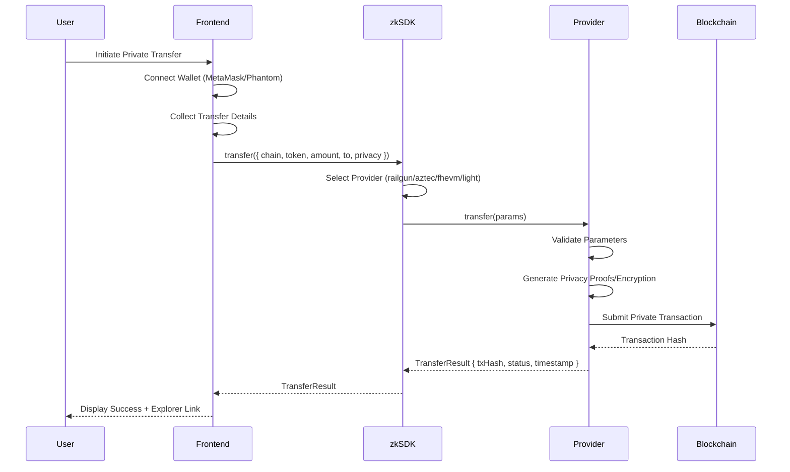
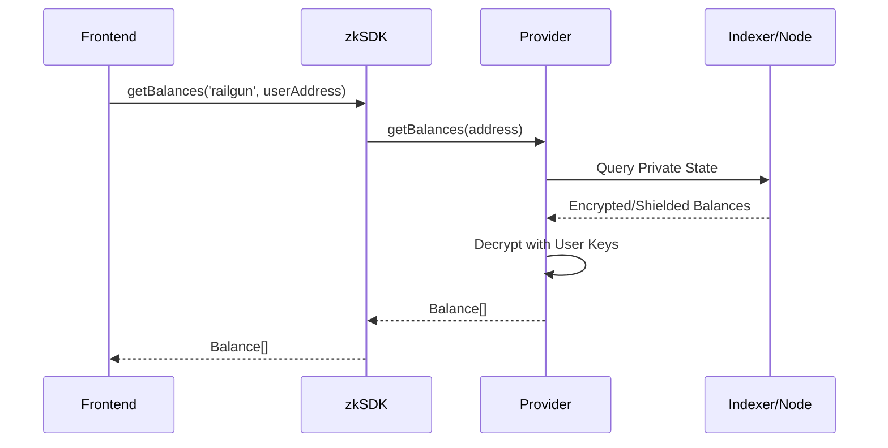

# zkSDK Architecture Overview

**Version**: 1.0.0-beta
**Last Updated**: 2025-10-22

> "The LangChain of Privacy" - Universal SDK for private blockchain transactions

---

## Table of Contents

1. [System Overview](#system-overview)
2. [Architecture Layers](#architecture-layers)
3. [Data Flow](#data-flow)
4. [Provider Environments](#provider-environments)
5. [Component Details](#component-details)
6. [Security Model](#security-model)

---

## System Overview

zkSDK is a universal privacy SDK that provides a **unified API** for executing private transactions across multiple blockchain privacy protocols. It abstracts the complexity of different privacy implementations behind a consistent interface.

### Core Design Principles

- **Unified API**: Same interface for all privacy providers
- **Provider Agnostic**: Support multiple privacy protocols (Railgun, Aztec, FHEVM, Privacy Cash, Bitcoin)
- **Modular Architecture**: Each provider is independently implemented and maintained
- **Type Safety**: Full TypeScript support with strict typing
- **Environment Flexible**: Works in both browser and Node.js environments

---

## Architecture Layers

```
┌─────────────────────────────────────────────────────────────────┐
│                    APPLICATION LAYER                            │
│  (Frontend: React/Vue/Next.js, Backend: Node.js/Express)       │
│                                                                 │
│  - User Interface                                              │
│  - Wallet Connections (MetaMask, Phantom, etc.)                │
│  - Business Logic                                              │
└────────────────────────────┬────────────────────────────────────┘
                             │
                             │ zkSDK API
                             │
┌────────────────────────────▼────────────────────────────────────┐
│                    @zksdk/core                                  │
│               Universal Privacy SDK Layer                       │
│                                                                 │
│  ┌──────────────────────────────────────────────────────────┐  │
│  │  ZkSDK                                                   │  │
│  │  - Provider Registry                                     │  │
│  │  - transfer(params, providerName?)                       │  │
│  │  - getBalances(providerName, address)                    │  │
│  │  - getTransactionStatus(providerName, txHash)            │  │
│  └──────────────────────────────────────────────────────────┘  │
│                                                                 │
│  ┌──────────────────────────────────────────────────────────┐  │
│  │  BasePrivacyProvider (Abstract)                          │  │
│  │  - initialize(config): Promise<void>                     │  │
│  │  - transfer(params): Promise<TransferResult>             │  │
│  │  - getBalances(address): Promise<Balance[]>              │  │
│  │  - getTransactionStatus(txHash): Promise<TransferResult> │  │
│  └──────────────────────────────────────────────────────────┘  │
└────────────────────────────┬────────────────────────────────────┘
                             │
           ┌─────────────────┼─────────────────┬────────────┐
           │                 │                 │            │
┌──────────▼────────┐ ┌─────▼──────┐ ┌────────▼─────┐ ┌───▼────────┐
│  @zksdk/providers │ │  @zksdk/   │ │  @zksdk/     │ │  @zksdk/   │
│   /railgun        │ │  providers │ │  providers   │ │  providers │
│                   │ │   /aztec   │ │   /fhevm     │ │   /light   │
│ RailgunProvider   │ │            │ │              │ │            │
│ - walletMnemonic  │ │ AztecProvider│ FHEVMProvider│ │LightProtocol│
│ - engineDbPath    │ │ - pxeConfig│ │ - signer     │ │Provider    │
│ - rpcEndpoints    │ │            │ │ - aclAddress │ │ - keypair  │
└──────────┬────────┘ └─────┬──────┘ └────────┬─────┘ └───┬────────┘
           │                │                 │            │
┌──────────▼────────────────▼─────────────────▼────────────▼────────┐
│                   BLOCKCHAIN NETWORKS                             │
│                                                                   │
│  Ethereum │ Polygon │ Arbitrum │ Aztec L2 │ Zama │ Solana        │
│                                                                   │
│  - Public networks with privacy layers                           │
│  - Each provider routes to appropriate network(s)                │
└───────────────────────────────────────────────────────────────────┘
```

---

## Data Flow

### Transfer Execution Flow



### Balance Query Flow



---

## Provider Environments

| Provider | Browser | Node.js | Environment Notes |
|----------|---------|---------|-------------------|
| **Railgun** | ✅ | ✅ | Uses IndexedDB (browser) or file-based DB (Node.js) for state |
| **Aztec** | ⚠️ | ✅ | Requires PXE server connection (typically Node.js or remote) |
| **FHEVM** | ✅ | ✅ | Standard RPC + fhevmjs encryption library |
| **Privacy Cash** | ✅ | ✅ | Solana RPC + Helius indexer for compressed state |
| **Bitcoin** | ✅ | ✅ | BIP352 Silent Payments (wallet-only, no full node required) |

### Storage Requirements

**Railgun**
- **Browser**: IndexedDB (~50-200MB for transaction history)
- **Node.js**: LevelDB file storage at `engineDbPath`

**Aztec**
- **PXE Server**: Manages all private state
- **Client**: Minimal storage (account keys only)

**FHEVM**
- **None**: Stateless encryption, all data on-chain

**Privacy Cash**
- **Minimal**: Solana Keypair only
- **Indexer**: Helius provides compressed account lookups

---

## Component Details

### @zksdk/core

**Purpose**: Unified SDK interface and provider management

**Key Exports**:
```typescript
// Main SDK class
export class ZkSDK {
  constructor(config: ZkSDKConfig)
  addProvider(name: string, provider: BasePrivacyProvider): void
  getProvider(name: string): BasePrivacyProvider
  transfer(params: TransferParams, providerName?: string): Promise<TransferResult>
  getBalances(providerName: string, address: string): Promise<Balance[]>
  getTransactionStatus(providerName: string, txHash: string): Promise<TransferResult>
}

// Base provider interface
export abstract class BasePrivacyProvider {
  abstract initialize(config: ProviderConfig): Promise<void>
  abstract transfer(params: TransferParams): Promise<TransferResult>
  abstract getBalances(address: string): Promise<Balance[]>
  abstract getTransactionStatus(txHash: string): Promise<TransferResult>
}

// Core types
export type Network = 'ethereum' | 'polygon' | 'arbitrum' | 'solana' | 'aztec' | string
export type PrivacyLevel = 'anonymous' | 'shielded' | 'public'
export interface TransferParams { chain, token, amount, to, privacy, memo? }
export interface TransferResult { transactionHash, status, explorerUrl?, fee?, timestamp }
export interface Balance { token, balance, usdValue? }
```

### @zksdk/providers/railgun

**Purpose**: EVM privacy via Railgun shielded pools

**Wallet Type**: `RailgunWallet` (mnemonic-based)

**Initialization**:
```typescript
const railgun = new RailgunProvider();
await railgun.initialize({
  walletMnemonic: '12/24 word phrase',
  engineDbPath: './railgun-db',
  rpcEndpoints: {
    ethereum: 'https://eth.llamarpc.com',
    polygon: 'https://polygon-rpc.com'
  }
});
```

**Dependencies**:
- `@railgun-community/engine`: Core Railgun SDK
- RPC endpoints for each supported chain
- Local database for transaction history

**Detailed Documentation**: See [Railgun EVM Privacy](./backend/railgun-evm-privacy.md) for comprehensive integration guide

### @zksdk/providers/aztec

**Purpose**: Privacy-first L2 with encrypted smart contracts

**Wallet Type**: PXE `AccountWallet`

**Initialization**:
```typescript
const aztec = new AztecProvider();
await aztec.initialize({
  type: 'aztec',
  chainId: 1,
  networkType: 'testnet',
  pxeConfig: {
    pxeUrl: 'http://localhost:8080', // or remote PXE
    accountMnemonic: '12/24 word phrase'
  }
});
```

**Dependencies**:
- `@aztec/aztec.js`: Aztec SDK
- PXE server (Private Execution Environment)
- Account service for key management
- Contract service for Noir contracts

### @zksdk/providers/fhevm

**Purpose**: Fully homomorphic encryption for confidential computation

**Wallet Type**: `ethers.Signer` (standard EVM)

**Initialization**:
```typescript
const fhevm = new FHEVMProvider({
  rpcUrl: 'https://devnet.zama.ai',
  chainId: 9000,
  aclAddress: '0x...' // ACL contract for key management
});

const signer = new ethers.Wallet(privateKey, provider);
await fhevm.connect(signer);
```

**Dependencies**:
- `ethers` v6
- `fhevmjs`: Encryption library
- Zama devnet RPC
- ACL contract for public key fetching

### @zksdk/providers/light-protocol

**Purpose**: Solana ZK compression (99% cost reduction)

**Wallet Type**: Solana `Keypair`

**Initialization**:
```typescript
const light = new LightProtocolProvider();
await light.initialize({
  keypair: Keypair.fromSecretKey(secretKeyBytes),
  rpcUrl: 'https://api.mainnet-beta.solana.com',
  heliusApiKey: 'your-helius-key' // for compressed state indexing
});
```

**Dependencies**:
- `@solana/web3.js`: Solana SDK
- `@lightprotocol/sdk`: Privacy Cash SDK
- Helius indexer for compressed account lookups

### @zksdk/providers/bitcoin

**Purpose**: BIP352 Silent Payments for Bitcoin privacy

**Wallet Type**: BIP352 Silent Payment Address

**Initialization**:
```typescript
const bitcoin = new BitcoinProvider();
await bitcoin.initialize({
  network: 'mainnet',
  silentPaymentKey: scanPrivateKey,
  rpcUrl: 'https://bitcoin-rpc.com' // optional
});
```

**Dependencies**:
- `bitcoinjs-lib`: Bitcoin utilities
- BIP352 silent payment implementation

---

## Security Model

### Credential Handling

**Frontend**:
- ❌ **NEVER** hardcode mnemonics or private keys
- ❌ **NEVER** store sensitive credentials in localStorage/sessionStorage
- ✅ **ALWAYS** prompt user for credentials securely
- ✅ **CONSIDER** hardware wallet integration for production

**Backend**:
- ✅ Store credentials in secure environment variables
- ✅ Use encrypted key storage (HashiCorp Vault, AWS KMS)
- ✅ Implement proper access controls
- ✅ Rotate credentials regularly

### Provider-Specific Security

**Railgun**:
- Mnemonic controls shielded wallet
- Database contains transaction history (encrypt at rest)
- RPC endpoints should be trusted

**Aztec**:
- PXE server has full access to private state
- Use local PXE for maximum privacy
- Remote PXE must be trusted

**FHEVM**:
- Signer keys control wallet (same as standard Ethereum)
- Encrypted values can only be decrypted by authorized contracts
- ACL contract manages decryption permissions

**Privacy Cash**:
- Solana Keypair controls all assets
- Compressed state still requires Solana consensus
- Helius indexer is trusted for state lookups (can run own indexer)

### Network Security

- ✅ **ALWAYS** use HTTPS for RPC endpoints
- ✅ **VERIFY** SSL certificates
- ✅ **VALIDATE** all user inputs before passing to providers
- ✅ **IMPLEMENT** rate limiting for public APIs
- ✅ **MONITOR** for suspicious transactions

---

## Network Support Matrix

| Provider | Ethereum | Polygon | Arbitrum | BSC | Solana | Bitcoin | Aztec L2 |
|----------|----------|---------|----------|-----|--------|---------|----------|
| Railgun | ✅ | ✅ | ✅ | ✅ | ❌ | ❌ | ❌ |
| Aztec | 🔗 | 🔗 | 🔗 | ❌ | ❌ | ❌ | ✅ |
| FHEVM | ✅ | ❌ | ❌ | ❌ | ❌ | ❌ | ❌ |
| Privacy Cash | ❌ | ❌ | ❌ | ❌ | ✅ | ❌ | ❌ |
| Bitcoin | ❌ | ❌ | ❌ | ❌ | ❌ | ✅ | ❌ |

**Legend**:
- ✅ Native support
- 🔗 Aztec L2 settles to Ethereum L1
- ❌ Not supported

---

## Next Steps

- **Integration Guide**: See [PROVIDER_COMPARISON.md](./PROVIDER_COMPARISON.md) to choose the right provider
- **Data Flows**: See [INTEGRATION_FLOWS.md](./INTEGRATION_FLOWS.md) for detailed sequence diagrams
- **Backend Integration**: See [docs/backend/](./backend/) for provider-specific guides
- **Frontend Integration**: See [docs/frontend/](./frontend/) for wallet connection guides

---

**Questions?** Open an issue at [GitHub Repository URL]
