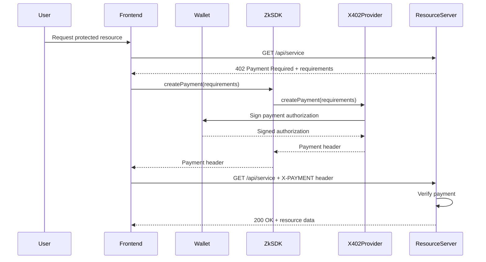
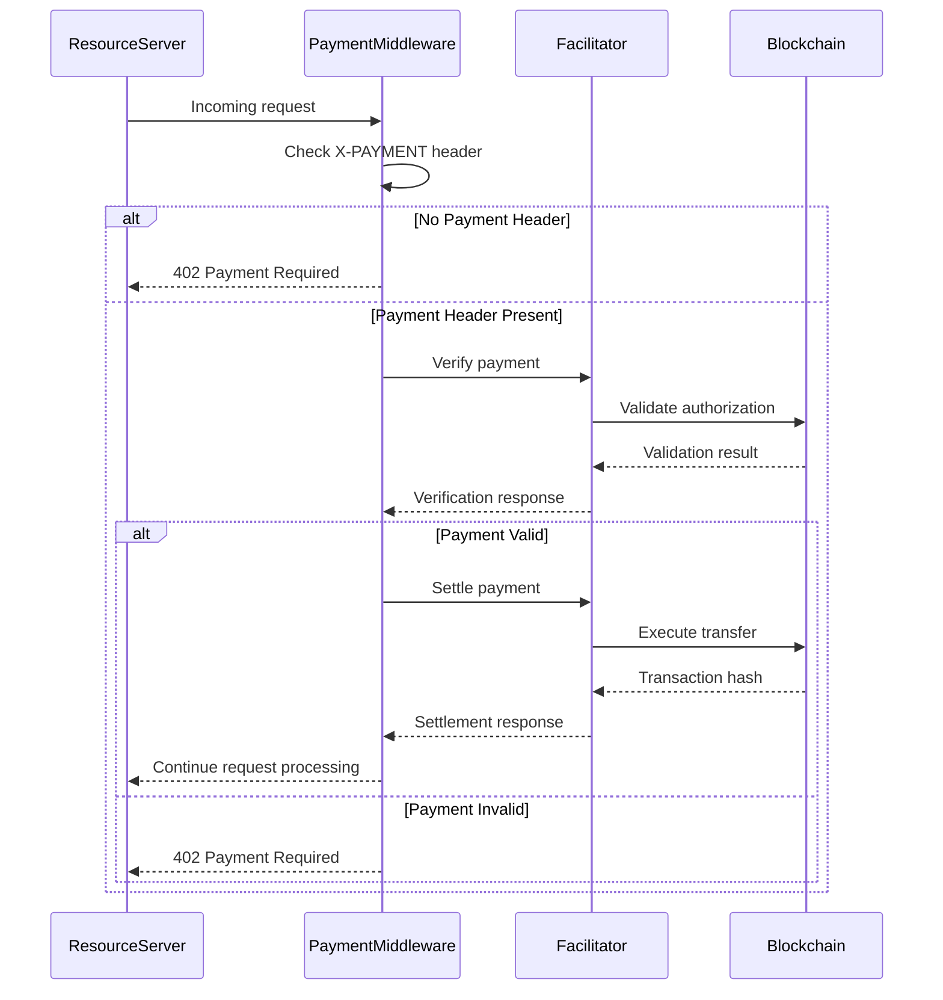

# zkSDK x402 Integration Reference

## Table of Contents
1. [Overview](#overview)
2. [Architecture](#architecture)
3. [Core Components](#core-components)
4. [API Reference](#api-reference)
5. [Integration Examples](#integration-examples)
6. [Configuration](#configuration)
7. [Error Handling](#error-handling)
8. [Security Considerations](#security-considerations)
9. [Performance Guidelines](#performance-guidelines)
10. [Testing](#testing)

## Overview

The x402 integration brings micropayment capabilities to zkSDK, enabling developers to monetize privacy services with sub-cent precision. This reference document provides technical details for integrating x402 payments into zkSDK applications.

## Architecture

### System Components

```
┌─────────────────────────────────────────────────────────────┐
│                    APPLICATION LAYER                        │
│  (Frontend: React/Vue, Backend: Node.js/Express)           │
│                                                             │
│  - User Interface                                          │
│  - Wallet Connections                                      │
│  - Business Logic                                          │
└────────────────────────────┬────────────────────────────────┘
                             │
                  ┌─────────▼─────────┐
                  │    @zksdk/core    │
                  │   ZkSDK Class     │
                  └─────────┬─────────┘
                            │
        ┌───────────────────┼───────────────────┐
        │                   │                   │
┌───────▼────────┐ ┌───────▼────────┐ ┌────────▼────────┐
│ @zksdk/providers │ │ @zksdk/providers │ │ @zksdk/providers  │
│     /x402        │ │     /railgun     │ │    /middleware    │
│                  │ │                  │ │  (Express/FastAPI)│
│ X402Provider     │ │ RailgunProvider  │ │ PaymentMiddleware │
└───────┬────────┘ └────────┬─────────┘ └────────┬────────┘
        │                   │                    │
        └───────────────────┼────────────────────┘
                            │
                   ┌────────▼────────┐
                   │   x402 SDK      │
                   │  (@coinbase/x402)│
                   └────────┬────────┘
                            │
        ┌───────────────────┼───────────────────┐
        │                   │                   │
┌───────▼────────┐ ┌───────▼────────┐ ┌────────▼────────┐
│  Blockchain    │ │  Facilitator   │ │   Resource      │
│  Networks      │ │  Services      │ │   Servers       │
│                │ │                │ │                 │
│ - EVM chains   │ │ - Verification │ │ - API services  │
│ - SVM chains   │ │ - Settlement   │ │ - Web apps      │
│ - Sui (future) │ │ - Discovery    │ │ - AI agents     │
└────────────────┘ └────────────────┘ └─────────────────┘
```

### Data Flow

#### Client-Side Payment Flow


#### Server-Side Payment Processing


## Core Components

### X402Provider

The main provider class that integrates x402 payments into zkSDK.

```typescript
import { BasePrivacyProvider } from '@zksdk/core';
import { X402Provider } from '@zksdk/providers/x402';

export interface X402Config {
  facilitatorUrl?: string;
  defaultNetwork?: string;
  networks?: Record<string, NetworkConfig>;
}

export interface NetworkConfig {
  chainId: number;
  rpcUrl: string;
  usdcAddress: string;
}

export class X402Provider extends BasePrivacyProvider {
  name = 'x402';
  
  async initialize(config: X402Config): Promise<void>;
  async createPayment(requirements: PaymentRequirements): Promise<PaymentResult>;
  async verifyPayment(payment: PaymentPayload, requirements: PaymentRequirements): Promise<boolean>;
  async getSupportedSchemes(): Promise<Scheme[]>;
}
```

### PaymentMiddleware

Express middleware for protecting API endpoints with x402 payments.

```typescript
import { paymentMiddleware } from '@zksdk/middleware';

// Basic usage
app.use(paymentMiddleware(
  '0xYourWalletAddress',
  {
    '/api/premium': {
      price: '$0.001',
      network: 'base'
    }
  }
));

// Advanced configuration
app.use(paymentMiddleware(
  '0xYourWalletAddress',
  {
    '/api/*': {
      price: '$0.001',
      network: 'base',
      config: {
        description: 'API access',
        maxTimeoutSeconds: 120,
        mimeType: 'application/json'
      }
    }
  },
  {
    url: 'https://facilitator.example.com',
    createAuthHeaders: async () => ({
      verify: { "Authorization": "Bearer token" },
      settle: { "Authorization": "Bearer token" }
    })
  }
));
```

## API Reference

### ZkSDK.x402 Methods

#### initialize(config: X402Config)
Initialize the x402 provider with configuration.

```typescript
const x402 = new X402Provider();
await x402.initialize({
  facilitatorUrl: 'https://facilitator.x402.org',
  defaultNetwork: 'base',
  networks: {
    base: {
      chainId: 8453,
      rpcUrl: 'https://mainnet.base.org',
      usdcAddress: '0x833589fCD6eDb6E08f4c7C32D4f71b54bdA02913'
    },
    'base-sepolia': {
      chainId: 84532,
      rpcUrl: 'https://sepolia.base.org',
      usdcAddress: '0x036CbD53842c5426634e7929541eC2318f3dCF7e'
    }
  }
});
```

#### createPayment(requirements: PaymentRequirements)
Create a payment authorization for the given requirements.

```typescript
const paymentRequirements = {
  scheme: 'exact',
  network: 'base',
  maxAmountRequired: '1000',
  asset: '0x833589fCD6eDb6E08f4c7C32D4f71b54bdA02913',
  payTo: '0xYourWalletAddress',
  resource: 'https://api.example.com/service',
  description: 'API service access',
  mimeType: 'application/json',
  maxTimeoutSeconds: 60,
  extra: {
    name: 'USDC',
    version: '2'
  }
};

const paymentResult = await x402.createPayment(paymentRequirements);
// Returns: { paymentHeader: 'base64-encoded-payment' }
```

#### verifyPayment(payment: PaymentPayload, requirements: PaymentRequirements)
Verify a payment with the facilitator.

```typescript
const isValid = await x402.verifyPayment(paymentPayload, paymentRequirements);
// Returns: boolean
```

### PaymentMiddleware Configuration

#### Basic Route Protection
```typescript
app.use(paymentMiddleware(
  '0xYourWalletAddress',
  {
    '/api/weather': {
      price: '$0.001',
      network: 'base-sepolia'
    }
  }
));
```

#### Multiple Routes
```typescript
app.use(paymentMiddleware(
  '0xYourWalletAddress',
  {
    '/api/weather': {
      price: '$0.001',
      network: 'base-sepolia'
    },
    '/api/premium/*': {
      price: '$0.01',
      network: 'base'
    },
    '/api/enterprise/*': {
      price: {
        amount: '1000000', // 1 USDC in atomic units
        asset: {
          address: '0x833589fCD6eDb6E08f4c7C32D4f71b54bdA02913',
          decimals: 6,
          eip712: {
            name: 'USDC',
            version: '2'
          }
        }
      },
      network: 'base'
    }
  }
));
```

#### Advanced Configuration
```typescript
app.use(paymentMiddleware(
  '0xYourWalletAddress',
  {
    '/api/service': {
      price: '$0.001',
      network: 'base',
      config: {
        description: 'API service access',
        mimeType: 'application/json',
        maxTimeoutSeconds: 120,
        outputSchema: {
          type: 'object',
          properties: {
            data: { type: 'string' },
            timestamp: { type: 'number' }
          }
        },
        discoverable: true
      }
    }
  },
  {
    url: 'https://your-facilitator.com',
    createAuthHeaders: async () => ({
      verify: { 
        "Authorization": `Bearer ${process.env.FACILITATOR_API_KEY}` 
      },
      settle: { 
        "Authorization": `Bearer ${process.env.FACILITATOR_API_KEY}` 
      }
    })
  },
  {
    appName: 'My zkSDK App',
    appLogo: '/logo.png',
    cdpClientKey: process.env.CDP_CLIENT_KEY
  }
));
```

## Integration Examples

### Frontend Integration (React)

```typescript
import { useEffect, useState } from 'react';
import { ZkSDK } from '@zksdk/core';
import { X402Provider } from '@zksdk/providers/x402';

function WeatherWidget() {
  const [weather, setWeather] = useState(null);
  const [loading, setLoading] = useState(false);
  const [error, setError] = useState(null);

  const sdk = new ZkSDK({
    providers: {
      x402: new X402Provider()
    }
  });

  useEffect(() => {
    // Initialize x402 provider
    sdk.getProvider('x402').initialize({
      facilitatorUrl: 'https://facilitator.x402.org',
      defaultNetwork: 'base-sepolia'
    });
  }, []);

  const fetchWeather = async () => {
    setLoading(true);
    setError(null);
    
    try {
      const response = await fetch('/api/weather');
      
      if (response.status === 402) {
        // Handle payment required
        const paymentRequirements = await response.json();
        
        // Create payment using zkSDK
        const paymentResult = await sdk.getProvider('x402').createPayment(
          paymentRequirements.accepts[0]
        );
        
        // Retry request with payment
        const paidResponse = await fetch('/api/weather', {
          headers: {
            'X-PAYMENT': paymentResult.paymentHeader
          }
        });
        
        if (paidResponse.ok) {
          const data = await paidResponse.json();
          setWeather(data);
        } else {
          throw new Error('Payment failed');
        }
      } else if (response.ok) {
        const data = await response.json();
        setWeather(data);
      } else {
        throw new Error('Request failed');
      }
    } catch (err) {
      setError(err.message);
    } finally {
      setLoading(false);
    }
  };

  return (
    <div>
      <button onClick={fetchWeather} disabled={loading}>
        {loading ? 'Loading...' : 'Get Weather'}
      </button>
      
      {error && <div>Error: {error}</div>}
      
      {weather && (
        <div>
          <h3>Weather Report</h3>
          <p>Temperature: {weather.report.temperature}°F</p>
          <p>Conditions: {weather.report.weather}</p>
        </div>
      )}
    </div>
  );
}
```

### Backend Integration (Express)

```typescript
import express from 'express';
import { config } from 'dotenv';
import { paymentMiddleware } from '@zksdk/middleware';

config();

const app = express();

// Protect routes with x402 payments
app.use(
  paymentMiddleware(
    process.env.WALLET_ADDRESS as `0x${string}`,
    {
      'GET /api/weather': {
        price: '$0.001',
        network: 'base-sepolia',
        config: {
          description: 'Weather data API access',
          mimeType: 'application/json'
        }
      },
      '/api/premium/*': {
        price: '$0.01',
        network: 'base',
        config: {
          description: 'Premium API access',
          mimeType: 'application/json'
        }
      }
    },
    {
      url: process.env.FACILITATOR_URL || 'https://facilitator.x402.org'
    },
    {
      appName: 'Weather API',
      appLogo: '/logo.png'
    }
  )
);

// Protected endpoints
app.get('/api/weather', (req, res) => {
  res.json({
    report: {
      weather: 'sunny',
      temperature: 72,
      timestamp: Date.now()
    }
  });
});

app.get('/api/premium/forecast', (req, res) => {
  res.json({
    forecast: {
      '3-day': ['sunny', 'partly-cloudy', 'rain'],
      '7-day': ['sunny', 'partly-cloudy', 'rain', 'storm', 'sunny', 'sunny', 'partly-cloudy']
    }
  });
});

app.listen(3000, () => {
  console.log('Server running on port 3000');
});
```

### AI Agent Integration

```typescript
import { ZkSDK } from '@zksdk/core';
import { X402Provider } from '@zksdk/providers/x402';

class PaymentCapableAgent {
  private sdk: ZkSDK;
  private budget: number;
  private spent: number;

  constructor(budget: number) {
    this.budget = budget;
    this.spent = 0;
    
    this.sdk = new ZkSDK({
      providers: {
        x402: new X402Provider()
      }
    });
  }

  async initialize() {
    await this.sdk.getProvider('x402').initialize({
      facilitatorUrl: 'https://facilitator.x402.org',
      defaultNetwork: 'base'
    });
  }

  async makePaymentRequest(url: string): Promise<any> {
    // Check budget
    if (this.spent >= this.budget) {
      throw new Error('Budget exceeded');
    }

    try {
      // Initial request
      const response = await fetch(url);
      
      if (response.status === 402) {
        // Get payment requirements
        const paymentData = await response.json();
        const requirements = paymentData.accepts[0];
        
        // Extract price (simplified)
        const price = parseInt(requirements.maxAmountRequired) / Math.pow(10, 6); // USDC decimals
        
        // Check if we can afford this
        if (this.spent + price > this.budget) {
          throw new Error('This payment would exceed budget');
        }
        
        // Create payment
        const x402Provider = this.sdk.getProvider('x402');
        const paymentResult = await x402Provider.createPayment(requirements);
        
        // Make paid request
        const paidResponse = await fetch(url, {
          headers: {
            'X-PAYMENT': paymentResult.paymentHeader
          }
        });
        
        if (paidResponse.ok) {
          // Update budget tracking
          this.spent += price;
          return await paidResponse.json();
        } else {
          throw new Error('Payment failed');
        }
      } else if (response.ok) {
        return await response.json();
      } else {
        throw new Error(`Request failed: ${response.status}`);
      }
    } catch (error) {
      console.error('Payment request failed:', error);
      throw error;
    }
  }

  getRemainingBudget(): number {
    return this.budget - this.spent;
  }

  getSpentAmount(): number {
    return this.spent;
  }
}

// Usage example
async function runAgent() {
  const agent = new PaymentCapableAgent(1.00); // $1.00 budget
  await agent.initialize();
  
  try {
    const weatherData = await agent.makePaymentRequest('https://api.weather.com/data');
    console.log('Weather data:', weatherData);
    console.log('Remaining budget:', agent.getRemainingBudget());
  } catch (error) {
    console.error('Agent operation failed:', error);
  }
}
```

## Configuration

### Environment Variables

```bash
# Wallet configuration
WALLET_ADDRESS=0xYourWalletAddress
WALLET_PRIVATE_KEY=your-private-key-here

# Facilitator configuration
FACILITATOR_URL=https://facilitator.x402.org
FACILITATOR_API_KEY=your-api-key

# Network configuration
BASE_RPC_URL=https://mainnet.base.org
BASE_SEPOLIA_RPC_URL=https://sepolia.base.org

# Application configuration
APP_NAME=My zkSDK Application
APP_LOGO_URL=/logo.png
```

### Network Configuration

```typescript
const networkConfig = {
  // EVM networks
  base: {
    chainId: 8453,
    rpcUrl: process.env.BASE_RPC_URL,
    usdcAddress: '0x833589fCD6eDb6E08f4c7C32D4f71b54bdA02913',
    facilitatorNetwork: 'base'
  },
  'base-sepolia': {
    chainId: 84532,
    rpcUrl: process.env.BASE_SEPOLIA_RPC_URL,
    usdcAddress: '0x036CbD53842c5426634e7929541eC2318f3dCF7e',
    facilitatorNetwork: 'base-sepolia'
  },
  ethereum: {
    chainId: 1,
    rpcUrl: process.env.ETHEREUM_RPC_URL,
    usdcAddress: '0xA0b86991c6218b36c1d19D4a2e9Eb0cE3606eB48',
    facilitatorNetwork: 'ethereum'
  },
  
  // SVM networks
  solana: {
    rpcUrl: process.env.SOLANA_RPC_URL,
    usdcAddress: 'EPjFWdd5AufqSSqeM2qN1xzybapC8G4wEGGkZwyTDt1v',
    facilitatorNetwork: 'solana'
  },
  'solana-devnet': {
    rpcUrl: process.env.SOLANA_DEVNET_RPC_URL,
    usdcAddress: '4zMMC9srt5Ri5X14GAgXhaHii3GnPAEERYPJgZJDncDU',
    facilitatorNetwork: 'solana-devnet'
  }
};
```

## Error Handling

### Common Error Types

```typescript
// x402-specific errors
interface X402Error extends Error {
  code: X402ErrorCode;
  reason?: string;
}

enum X402ErrorCode {
  INSUFFICIENT_FUNDS = 'insufficient_funds',
  INVALID_SIGNATURE = 'invalid_exact_evm_payload_signature',
  EXPIRED_AUTHORIZATION = 'invalid_exact_evm_payload_authorization_valid_before',
  FUTURE_AUTHORIZATION = 'invalid_exact_evm_payload_authorization_valid_after',
  INVALID_AMOUNT = 'invalid_exact_evm_payload_authorization_value',
  RECIPIENT_MISMATCH = 'invalid_exact_evm_payload_recipient_mismatch',
  UNSUPPORTED_SCHEME = 'invalid_scheme',
  UNSUPPORTED_NETWORK = 'invalid_network',
  INVALID_VERSION = 'invalid_x402_version',
  TRANSACTION_FAILED = 'invalid_transaction_state'
}

// Error handling example
async function safePaymentRequest(provider: X402Provider, requirements: PaymentRequirements) {
  try {
    const paymentResult = await provider.createPayment(requirements);
    return paymentResult;
  } catch (error) {
    if (error.code === X402ErrorCode.INSUFFICIENT_FUNDS) {
      console.log('User does not have enough funds for this payment');
      // Show top-up option to user
    } else if (error.code === X402ErrorCode.INVALID_SIGNATURE) {
      console.log('Payment signature is invalid');
      // Retry payment creation
    } else if (error.code === X402ErrorCode.EXPIRED_AUTHORIZATION) {
      console.log('Payment authorization has expired');
      // Refresh payment requirements and retry
    } else {
      console.error('Payment creation failed:', error);
    }
    throw error;
  }
}
```

### HTTP Status Code Mapping

| Status Code | Meaning | Action |
|-------------|---------|--------|
| 402 | Payment Required | Extract payment requirements and create payment |
| 400 | Bad Request | Check payment parameters |
| 401 | Unauthorized | Verify wallet connection |
| 403 | Forbidden | Check payment verification |
| 500 | Server Error | Retry or contact support |
| 502 | Bad Gateway | Facilitator unavailable, retry later |
| 503 | Service Unavailable | Temporary outage, retry later |

## Security Considerations

### Wallet Security

**Client-Side Best Practices**:
```typescript
// ❌ NEVER DO THIS
localStorage.setItem('privateKey', userPrivateKey);
console.log('Private key:', privateKey);

// ✅ DO THIS INSTEAD
// Use secure wallet connectors
import { ethers } from 'ethers';

// For browser applications, use injected wallets
if (typeof window.ethereum !== 'undefined') {
  const provider = new ethers.BrowserProvider(window.ethereum);
  const signer = await provider.getSigner();
  // Use signer for x402 payment creation
}

// For server applications, use environment variables
const privateKey = process.env.WALLET_PRIVATE_KEY;
if (!privateKey) {
  throw new Error('Wallet private key not configured');
}
const wallet = new ethers.Wallet(privateKey);
```

### Payment Security

**Signature Validation**:
```typescript
// Always verify payments before processing
const x402Provider = sdk.getProvider('x402');

// Verify payment with facilitator
const isValid = await x402Provider.verifyPayment(paymentPayload, requirements);
if (!isValid) {
  throw new Error('Invalid payment');
}

// Proceed with resource delivery
```

### Network Security

**HTTPS Requirements**:
```typescript
// Ensure all RPC endpoints use HTTPS
const secureConfig = {
  base: {
    rpcUrl: 'https://mainnet.base.org', // ✅ HTTPS
    // rpcUrl: 'http://mainnet.base.org', // ❌ HTTP - insecure
  }
};
```

## Performance Guidelines

### Caching Strategies

```typescript
// Cache payment requirements to reduce API calls
class PaymentCache {
  private cache: Map<string, { data: any; timestamp: number }> = new Map();
  private ttl: number = 5 * 60 * 1000; // 5 minutes

  get(key: string): any | null {
    const entry = this.cache.get(key);
    if (!entry) return null;
    
    if (Date.now() - entry.timestamp > this.ttl) {
      this.cache.delete(key);
      return null;
    }
    
    return entry.data;
  }

  set(key: string, data: any): void {
    this.cache.set(key, {
      data,
      timestamp: Date.now()
    });
  }

  clear(): void {
    this.cache.clear();
  }
}
```

### Batch Processing

```typescript
// For AI agents making multiple payments
async function batchPayments(agent: PaymentCapableAgent, requests: string[]) {
  const results = [];
  
  // Process requests sequentially to respect budget
  for (const url of requests) {
    try {
      const result = await agent.makePaymentRequest(url);
      results.push({ url, result, success: true });
    } catch (error) {
      results.push({ url, error: error.message, success: false });
    }
  }
  
  return results;
}
```

### Connection Pooling

```typescript
// Reuse HTTP connections for better performance
import http from 'http';
import https from 'https';

const httpAgent = new http.Agent({
  keepAlive: true,
  maxSockets: 50
});

const httpsAgent = new https.Agent({
  keepAlive: true,
  maxSockets: 50
});

// Configure fetch or axios to use agents
const fetchWithAgent = (url: string, options: any = {}) => {
  const agent = url.startsWith('https') ? httpsAgent : httpAgent;
  return fetch(url, { ...options, agent });
};
```

## Testing

### Unit Testing

```typescript
import { describe, it, expect, beforeEach } from 'vitest';
import { X402Provider } from '@zksdk/providers/x402';

describe('X402Provider', () => {
  let provider: X402Provider;

  beforeEach(() => {
    provider = new X402Provider();
  });

  describe('initialize', () => {
    it('should initialize with valid configuration', async () => {
      await provider.initialize({
        facilitatorUrl: 'https://facilitator.x402.org',
        defaultNetwork: 'base-sepolia'
      });
      
      expect(provider.isInitialized()).toBe(true);
    });

    it('should throw error with invalid configuration', async () => {
      await expect(provider.initialize({
        // Missing required fields
      })).rejects.toThrow();
    });
  });

  describe('createPayment', () => {
    beforeEach(async () => {
      await provider.initialize({
        facilitatorUrl: 'https://facilitator.x402.org',
        defaultNetwork: 'base-sepolia'
      });
    });

    it('should create valid payment header', async () => {
      const requirements = {
        scheme: 'exact',
        network: 'base-sepolia',
        maxAmountRequired: '1000',
        asset: '0x036CbD53842c5426634e7929541eC2318f3dCF7e',
        payTo: '0xTestAddress',
        resource: 'https://api.example.com/test',
        description: 'Test payment',
        mimeType: 'application/json',
        maxTimeoutSeconds: 60,
        extra: {
          name: 'USDC',
          version: '2'
        }
      };

      const result = await provider.createPayment(requirements);
      
      expect(result).toHaveProperty('paymentHeader');
      expect(typeof result.paymentHeader).toBe('string');
      expect(result.paymentHeader).toMatch(/^ey/); // Base64 starts with 'e'
    });
  });
});
```

### Integration Testing

```typescript
import { describe, it, expect, beforeAll } from 'vitest';
import express from 'express';
import { paymentMiddleware } from '@zksdk/middleware';

describe('PaymentMiddleware Integration', () => {
  let app: express.Application;
  let server: any;

  beforeAll(async () => {
    app = express();
    
    app.use(paymentMiddleware(
      '0xTestWalletAddress',
      {
        '/api/test': {
          price: '$0.001',
          network: 'base-sepolia'
        }
      }
    ));

    app.get('/api/test', (req, res) => {
      res.json({ message: 'Success' });
    });

    server = app.listen(3001);
  });

  it('should return 402 for requests without payment', async () => {
    const response = await fetch('http://localhost:3001/api/test');
    
    expect(response.status).toBe(402);
    
    const data = await response.json();
    expect(data).toHaveProperty('accepts');
    expect(Array.isArray(data.accepts)).toBe(true);
  });

  it('should return 200 for requests with valid payment', async () => {
    // This would require mocking the facilitator or using test facilitator
    // Implementation depends on test environment setup
  });
});
```

### Mock Facilitator for Testing

```typescript
// Mock facilitator for testing environments
class MockFacilitator {
  async verify(paymentPayload: any, requirements: any): Promise<any> {
    // Simulate verification logic
    return {
      isValid: true,
      payer: paymentPayload.payload.authorization.from
    };
  }

  async settle(paymentPayload: any, requirements: any): Promise<any> {
    // Simulate settlement logic
    return {
      success: true,
      transaction: '0x' + 'a'.repeat(64),
      network: paymentPayload.network,
      payer: paymentPayload.payload.authorization.from
    };
  }

  async supported(): Promise<any> {
    return {
      kinds: [
        {
          x402Version: 1,
          scheme: 'exact',
          network: 'base-sepolia'
        }
      ]
    };
  }
}
```

## Next Steps

### Documentation Resources
- [x402 Protocol Specification](https://github.com/coinbase/x402/blob/main/specs/x402-specification.md)
- [zkSDK Architecture Guide](../../ARCHITECTURE.md)
- [Integration Flows](../../INTEGRATION_FLOWS.md)
- [Provider Comparison](../../PROVIDER_COMPARISON.md)

### Example Projects
- `examples/x402-basic-integration`
- `examples/x402-ai-agent`
- `examples/x402-privacy-service`

### Support
For questions about x402 integration, contact:
- GitHub Issues: [zksdkjs/zkSDKjs](https://github.com/zksdkjs/zkSDKjs)
- Discord: zkSDK Development Channel
- Email: developers@zksdk.dev
