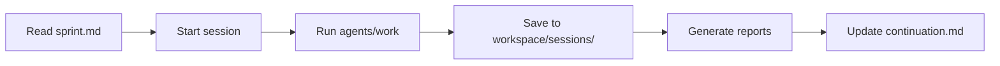

# 🎯 Framework V2 - Quick Reference Card

## 📍 Where to Put Things

| What | Where | Example |
|------|-------|---------|
| **Today's work** | `workspace/sessions/2025-10-23/` | `afternoon-developer.md` |
| **Current goals** | `workspace/current/sprint.md` | Update existing file |
| **Research findings** | `insights/research/market/` | `privacy-sdk-analysis-2025-10-23.md` |
| **Daily reports** | `insights/daily/2025/10-October/23/` | `session-report.md` |
| **New strategy** | `strategy/active/` | `v2-strategy-2025-10-23-1430.md` |
| **Big decisions** | `strategy/decisions/` | `ADR-002-defi-support.md` |
| **Future plans** | `strategy/roadmap/` | `bitcoin-integration-plan.md` |
| **Agent memory** | `workspace/memory/developer/` | `current_task.md` |
| **SDK code** | `sdk/packages/` | Standard TypeScript structure |
| **Test results** | `insights/daily/[date]/` | `test-results.md` |

## ⚡ Essential Commands

```bash
# Start your day
cat workspace/current/sprint.md                    # See current goals
./automation/scripts/start-new-session.sh          # Start work session

# During work
./automation/scripts/run-pm-research.sh            # Run market research
goose run --recipe automation/recipes/[name].yaml  # Run specific agent

# End your day
./automation/scripts/generate-daily-report.sh      # Create daily summary
echo "TODO: xyz" >> workspace/sessions/$(date +%Y-%m-%d)/continuation.md

# Find things
ls insights/daily/2025/10-October/23/              # Today's reports
cat strategy/active/current.md                     # Current strategy
find insights/research -name "*railgun*"           # Search research
```

## 🔄 The Daily Flow



## 📂 Folder Purposes

- **workspace/** = NOW (current work)
- **insights/** = PAST (what we learned)
- **strategy/** = FUTURE (where we're going)
- **sdk/** = PRODUCT (what we're building)
- **automation/** = SYSTEM (how we work)

## 🤖 For Goose Agents

```yaml
# At startup, read these:
1. workspace/current/sprint.md
2. workspace/current/blockers.md  
3. workspace/sessions/[TODAY]/continuation.md
4. strategy/active/current.md
5. workspace/memory/[YOUR-ROLE]/

# When saving, use:
Research: insights/research/[category]/[topic]-YYYY-MM-DD.md
Reports:  insights/daily/YYYY/MM-MonthName/DD/[type]-report.md
Session:  workspace/sessions/YYYY-MM-DD/[time]-[agent].md
Memory:   workspace/memory/[agent]/current_task.md
```

## 📝 File Naming

- Sessions: `morning-developer.md`
- Reports: `pm-research-report-2025-10-23.md`  
- Strategy: `v2-strategy-2025-10-23-1430.md`
- Decisions: `ADR-002-defi-support.md`
- Research: `railgun-analysis-2025-10-23.md`

## 🎨 Date Formats

- In filenames: `2025-10-23`
- In folders: `2025/10-October/23`
- Times: `1430` (for 2:30 PM)

## ✅ Before Stopping Work

1. Save session notes to `workspace/sessions/[today]/`
2. Update `continuation.md` with next steps
3. Run `generate-daily-report.sh`
4. Update `workspace/current/sprint.md` progress
5. Commit important changes to Git

---

**Full guide: [HOW-IT-WORKS.md](./HOW-IT-WORKS.md)**
**Agent rules: [.goose/RULES.md](./.goose/RULES.md)**
