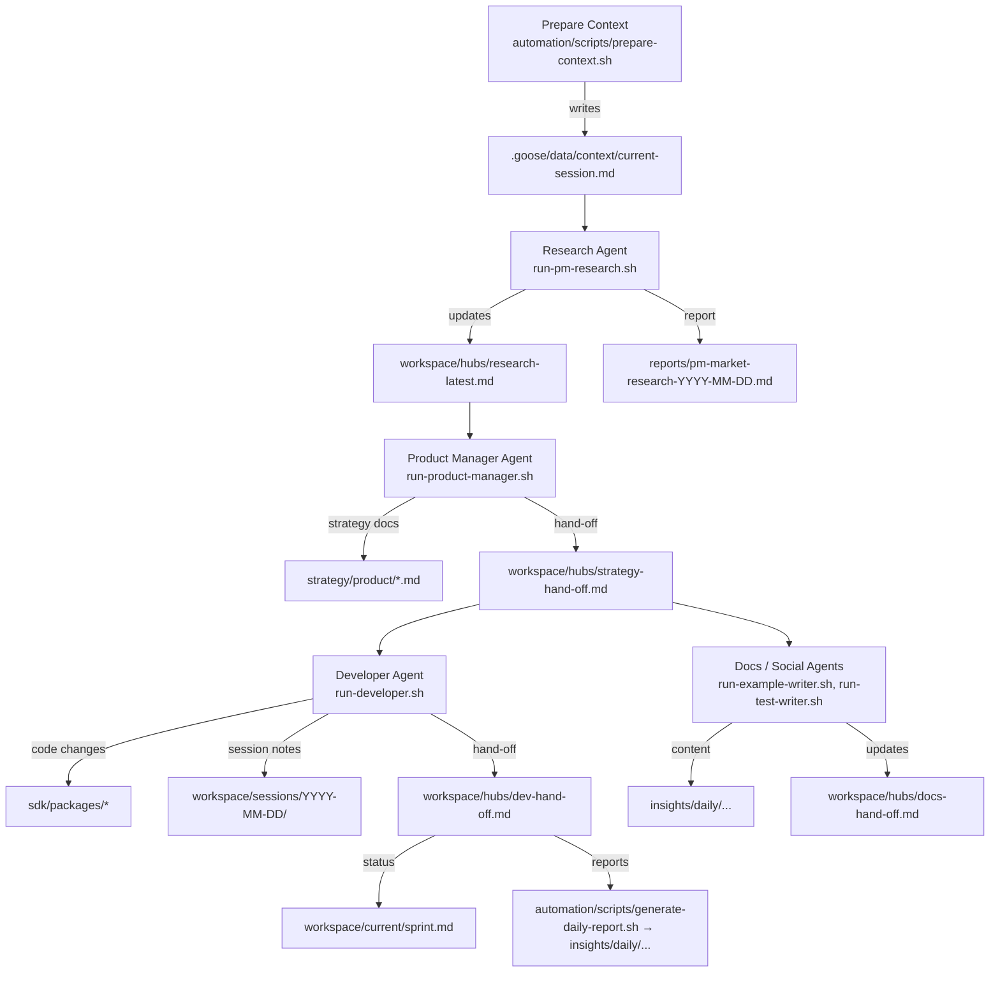

# Agent Pipeline Overview

End-to-end flow for the privacy-agent workspace after the Framework V2 refresh. Every agent reads the same context bundle, hands off work through the shared hubs, and produces outputs in predictable folders.

## High-Level Flow

All pipeline stages append a breadcrumb to `workspace/hubs/pipeline-log.md`, making it easy to audit which automation ran most recently.

## Shared Context & Inputs

- **Context bundle:** `.goose/data/context/current-session.md` combines `workspace/current/*.md`, the latest `workspace/sessions/*/continuation.md`, and all hub files. Regenerate it with `automation/scripts/prepare-context.sh`.
- **Goose hints:** `.goose/.goosehints` provides model-specific background; recipes automatically load it.
- **Required reads:** The rules in `.goose/RULES.md` still force each agent to read the sprint plan, blockers, continuation note, and role memory before acting.

## Stage 1 – Research Agent

- **Script:** `automation/scripts/run-pm-research.sh` (or `daily-run-strategy.sh` step 1).
- **Inputs:** Context bundle, `.goose/recipes/main/recipe-privacy-cash-researcher.yaml`.
- **Outputs:**
  - `reports/pm-market-research-YYYY-MM-DD.md` – canonical research report.
  - `workspace/hubs/research-latest.md` – summary + preview for downstream agents.
  - `workspace/hubs/pipeline-log.md` – timestamped entry (`pm-research ...`).
- **Follow-up:** Product Manager agent reads the hub file to incorporate the latest findings.

## Stage 2 – Product Strategy Agent

- **Scripts:** `automation/scripts/run-product-manager.sh`, wrapped by `daily-run-strategy.sh`.
- **Inputs:** Research hand-off, context bundle, `.goose/recipes/main/recipe-product-manager.yaml`.
- **Outputs:**
  - `strategy/product/*.md` – personas, requirements, architecture, GTM.
  - `workspace/hubs/strategy-hand-off.md` – lists new docs + quick previews.
  - `workspace/hubs/pipeline-log.md` – `product-manager ...` entry.
- **Next hops:** Developer pipeline and comms/doc agents consume `strategy-hand-off.md`.

## Stage 3 – Developer Agent

- **Scripts:** `automation/scripts/run-developer.sh` or `daily-run-dev.sh` (the latter also calls `generate-daily-report.sh` by default).
- **Inputs:** Strategy hand-off, context bundle, `.goose/recipes/main/recipe-developer.yaml`.
- **Outputs:**
  - Code under `sdk/packages/**`.
  - Session notes under `workspace/sessions/YYYY-MM-DD/`.
  - `workspace/hubs/dev-hand-off.md` – summary with link to the latest session log.
  - Optional coverage output from the `npm test --coverage` call.
  - Pipeline breadcrumb (`developer ...`) in `workspace/hubs/pipeline-log.md`.
- **Hand-off:** Update `workspace/current/sprint.md` and continuation files per `.goose/RULES.md`.

## Stage 4 – Docs, Blog, and Social Agents

- **Scripts:** `automation/scripts/run-example-writer.sh`, `automation/scripts/run-test-writer.sh`, plus custom Goose runs.
- **Inputs:** Strategy hand-off + dev hand-off hub files.
- **Outputs:** Documentation in `docs/`, examples in `sdk/examples/`, content in `insights/daily/...`, and status notes appended to `workspace/hubs/docs-hand-off.md`.
- **Reminder:** Drop any external-facing summary (tweets, blog drafts) into `insights/daily/` following the date structure.

## Stage 5 – Reporting & Continuity

- `automation/scripts/generate-daily-report.sh` aggregates the day into `insights/daily/YYYY/MM-MonthName/DD/daily-summary.md`.
- `workspace/sessions/YYYY-MM-DD/continuation.md` documents the next actions for whoever picks up later.
- `workspace/current/sprint.md` remains the single source for in-flight goals; update the checklist after each agent run.

## Running the Pipeline

- **Full strategy pass:** `automation/scripts/daily-run-strategy.sh`
- **Developer focus:** `automation/scripts/daily-run-dev.sh -- [developer args]`
- **Manual steps:** You can still call `run-pm-research.sh`, `run-product-manager.sh`, or `run-developer.sh` individually; each script refreshes the context bundle and hub files before launching Goose.

Keep the hub files tidy: every script overwrites its own hand-off file so the next agent always sees the latest state. If you add a new specialist (QA, marketing, etc.), give it a dedicated hub file in `workspace/hubs/` and update `prepare-context.sh` to include it in the context packet.
