# zkSDK Integration Flows

**Version**: 1.0.0-beta
**Last Updated**: 2025-10-22

This document provides detailed sequence diagrams and integration flows for common zkSDK operations.

---

## Table of Contents

1. [Frontend Wallet Connection](#frontend-wallet-connection)
2. [Provider Initialization](#provider-initialization)
3. [Private Transfer Execution](#private-transfer-execution)
4. [Balance Queries](#balance-queries)
5. [Transaction Status Tracking](#transaction-status-tracking)
6. [Error Handling Flows](#error-handling-flows)
7. [Multi-Provider Setup](#multi-provider-setup)

---

## Frontend Wallet Connection

### Railgun Wallet Connection

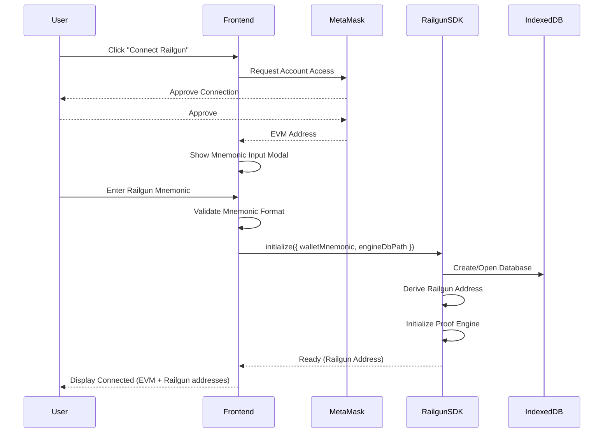

**Key Steps**:
1. Connect MetaMask for RPC access
2. Prompt user for Railgun mnemonic (separate from MetaMask)
3. Initialize Railgun engine with local database
4. Display both EVM and Railgun addresses

---

### Aztec Wallet Connection

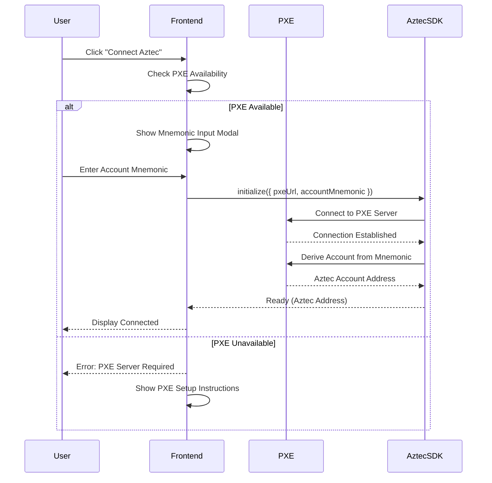

**Key Steps**:
1. Check PXE server availability (local or remote)
2. Prompt user for account mnemonic
3. Connect to PXE and derive account
4. Display Aztec address

---

### FHEVM Wallet Connection

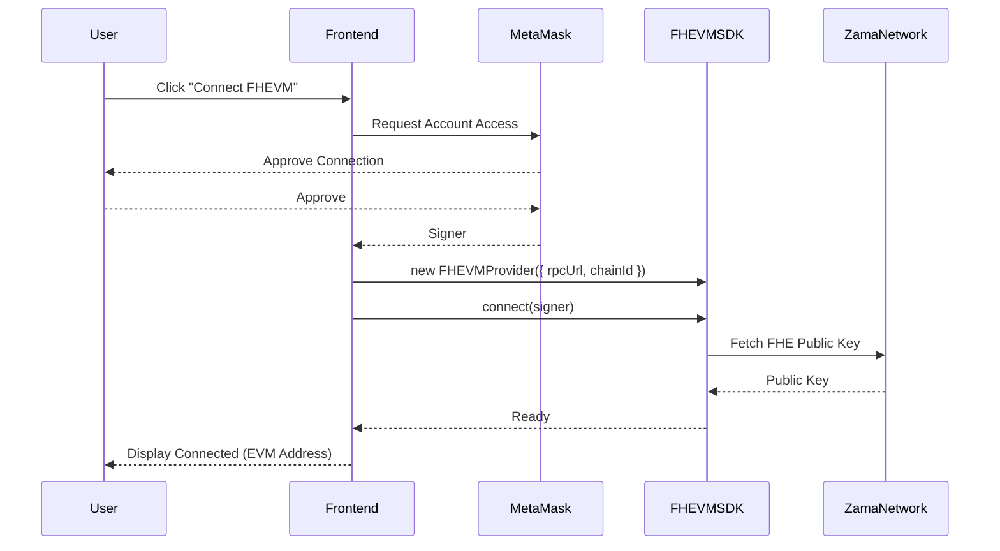

**Key Steps**:
1. Connect MetaMask (standard EVM wallet)
2. Extract signer from MetaMask
3. Initialize FHEVM provider with signer
4. Fetch FHE public key from network
5. Display connected EVM address

---

### Light Protocol Wallet Connection (Solana)

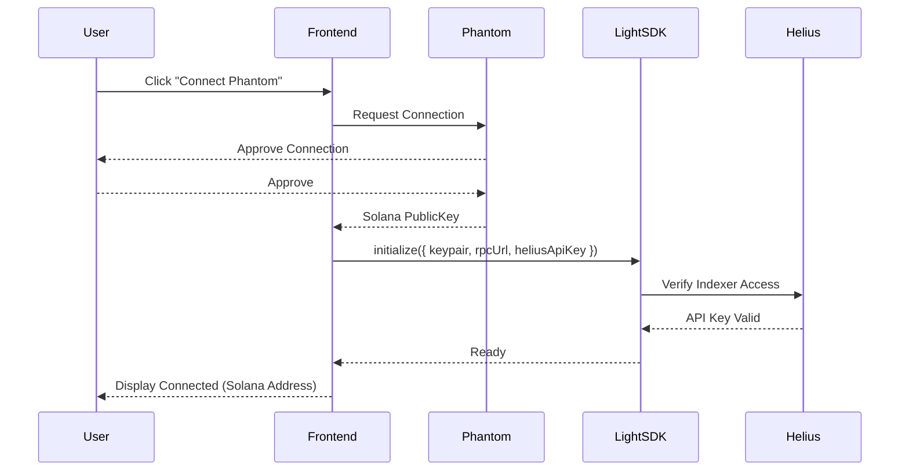

**Key Steps**:
1. Connect Phantom wallet
2. Extract Solana public key
3. Initialize Light Protocol with keypair
4. Verify Helius indexer access
5. Display Solana address

---

## Provider Initialization

### zkSDK Multi-Provider Setup

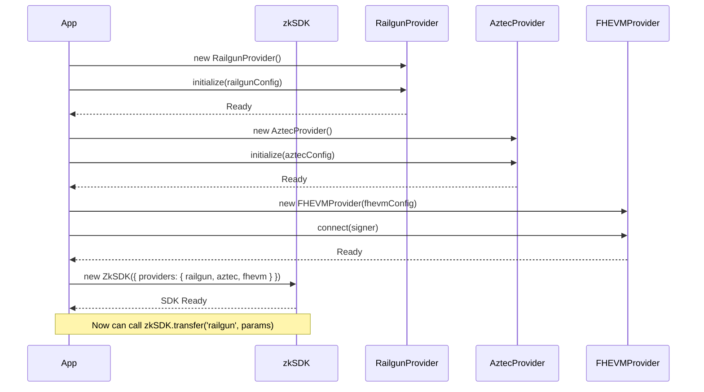

**Configuration Example**:
```typescript
// Initialize individual providers
const railgun = new RailgunProvider();
await railgun.initialize({
  walletMnemonic: userMnemonic,
  engineDbPath: './railgun-db',
  rpcEndpoints: { ethereum: ethRpc }
});

const aztec = new AztecProvider();
await aztec.initialize({
  type: 'aztec',
  chainId: 1,
  networkType: 'testnet',
  pxeConfig: { pxeUrl: 'http://localhost:8080' }
});

// Create unified SDK
const sdk = new ZkSDK({
  providers: { railgun, aztec },
  defaultProvider: 'railgun'
});
```

---

## Private Transfer Execution

### Railgun Private Transfer Flow

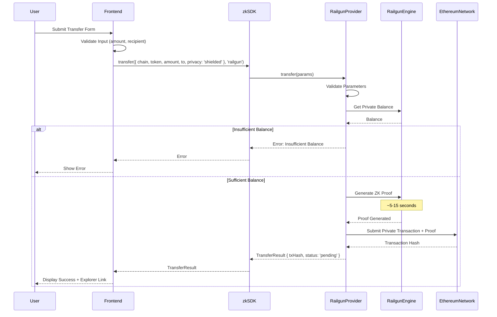

**Timeline**:
- Validation: < 1 second
- Proof Generation: 5-15 seconds
- Transaction Submission: 1-5 seconds
- Total: ~6-20 seconds before tx submission

---

### Aztec Private Transfer Flow

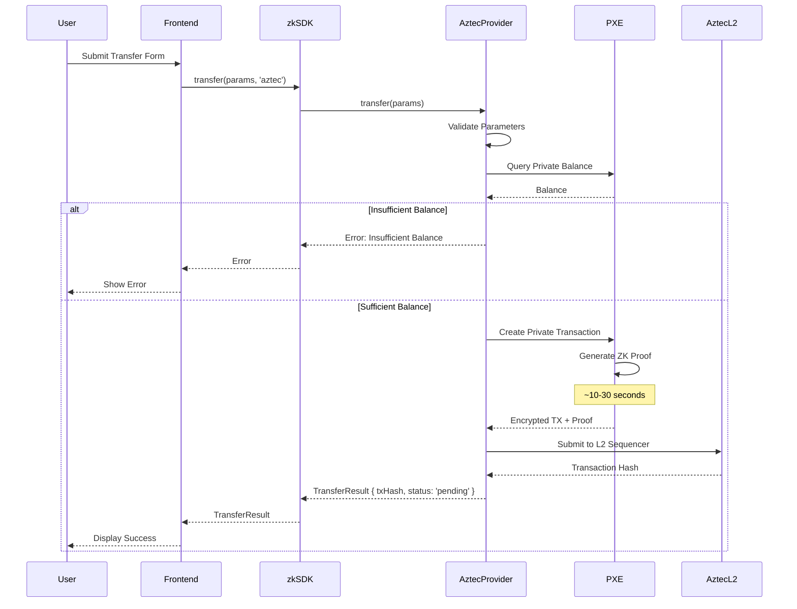

**Timeline**:
- Validation: < 1 second
- Proof Generation: 10-30 seconds
- L2 Submission: 1-3 seconds
- L2 Finality: ~1-3 seconds
- L1 Finality: ~15 minutes

---

### FHEVM Confidential Transfer Flow

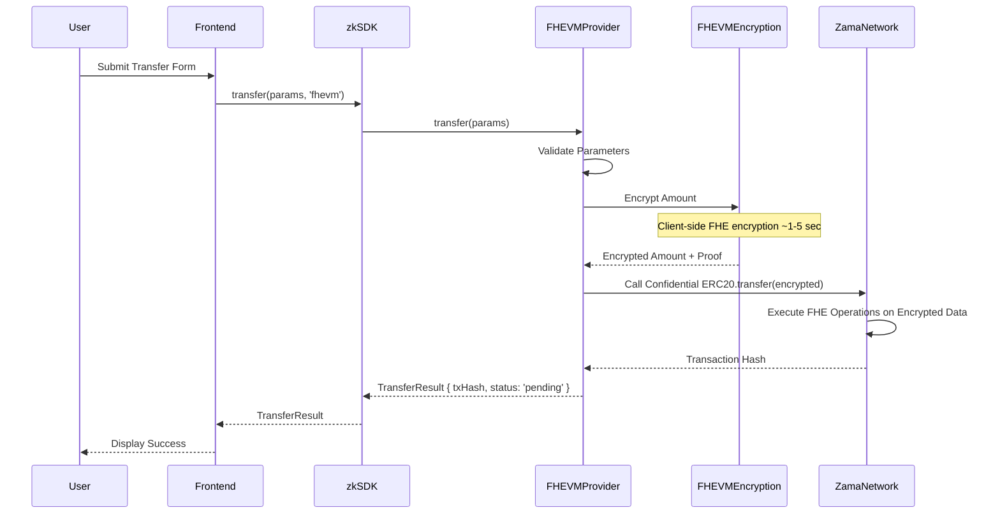

**Timeline**:
- Encryption: 1-5 seconds
- Transaction Submission: 1-3 seconds
- Network Finality: ~30 seconds (Zama devnet)

---

## Balance Queries

### Unified Balance Query Flow

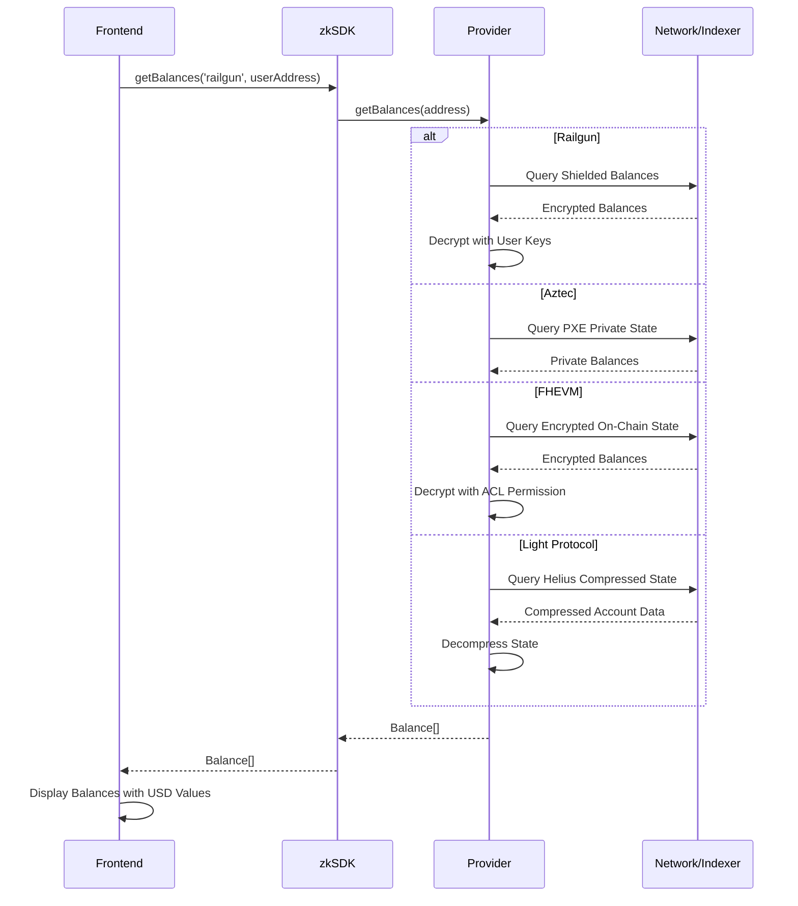

**Performance**:
- Railgun: 1-3 seconds (requires local decryption)
- Aztec: 0.5-2 seconds (PXE cached)
- FHEVM: 1-2 seconds (on-chain query)
- Light Protocol: 0.5-1 second (Helius indexed)

---

## Transaction Status Tracking

### Polling for Transaction Finality

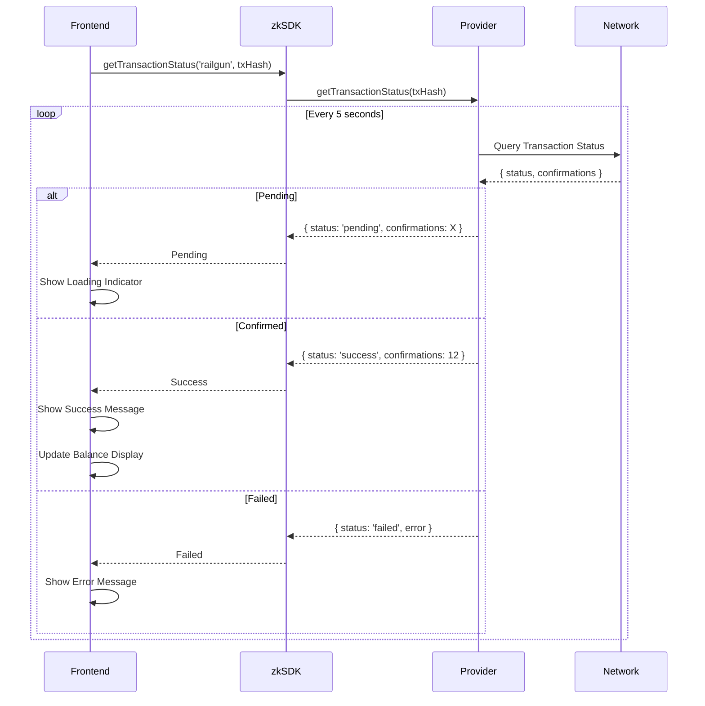

**Polling Intervals**:
- Ethereum/Polygon (Railgun): Poll every 5-10 seconds
- Aztec L2: Poll every 2-3 seconds (faster finality)
- Zama (FHEVM): Poll every 3-5 seconds
- Solana (Light): Poll every 1-2 seconds

---

## Error Handling Flows

### Comprehensive Error Handling

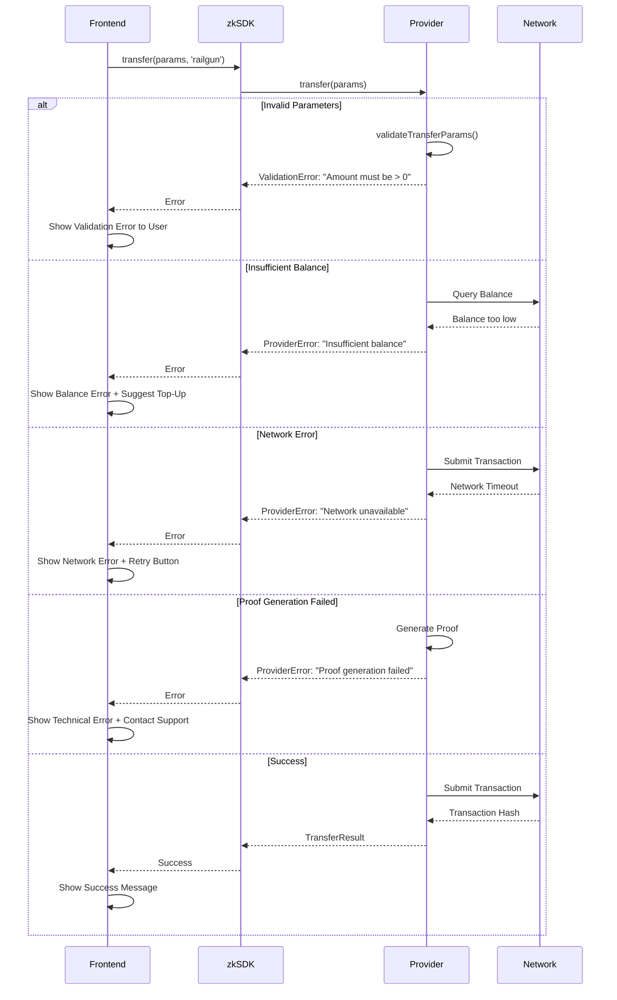

### Error Types and User Messages

| Error Type | User-Friendly Message | Recommended Action |
|------------|----------------------|-------------------|
| `ValidationError` | "Please check your input and try again" | Highlight invalid field |
| `InsufficientBalanceError` | "You don't have enough funds for this transfer" | Show balance + top-up button |
| `NetworkError` | "Connection issue. Please check your internet" | Retry button |
| `ProofGenerationError` | "Transaction preparation failed. Please try again" | Retry or contact support |
| `ProviderNotInitializedError` | "Please connect your wallet first" | Redirect to wallet connection |
| `UnsupportedChainError` | "This chain is not supported by [provider]" | Show supported chains list |

---

## Multi-Provider Setup

### Switching Between Providers

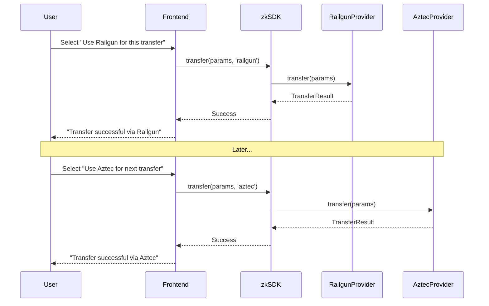

**Frontend Example**:
```typescript
const [selectedProvider, setSelectedProvider] = useState('railgun');

async function handleTransfer() {
  try {
    const result = await sdk.transfer({
      chain: 'ethereum',
      token: tokenAddress,
      amount: amountWei,
      to: recipientAddress,
      privacy: 'shielded'
    }, selectedProvider); // 'railgun' | 'aztec' | 'fhevm'

    showSuccess(`Transfer via ${selectedProvider} successful!`);
  } catch (error) {
    showError(error.message);
  }
}
```

---

## Security Considerations

### Credential Flow (Secure)

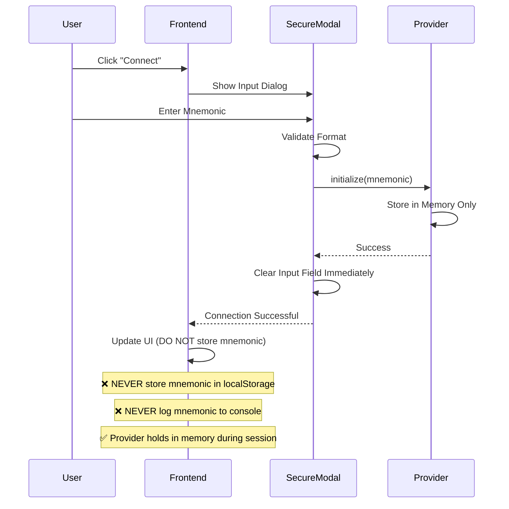

### Anti-Patterns to Avoid

```typescript
// ❌ NEVER DO THIS
localStorage.setItem('mnemonic', userMnemonic);
console.log('User mnemonic:', mnemonic);
const config = { walletMnemonic: 'hardcoded mnemonic here' };

// ✅ DO THIS INSTEAD
// Prompt user each session
const mnemonic = await promptSecureMnemonic();
provider.initialize({ walletMnemonic: mnemonic });
// Clear from scope immediately
mnemonic = null;
```

---

## Next Steps

1. **Choose Your Provider**: [PROVIDER_COMPARISON.md](./PROVIDER_COMPARISON.md)
2. **Backend Integration**: See [docs/backend/](./backend/) for provider-specific guides
3. **Frontend Integration**: See [docs/frontend/](./frontend/) for wallet connection guides
4. **System Architecture**: [ARCHITECTURE.md](./ARCHITECTURE.md)

---

**Questions about integration flows?** Open an issue at [GitHub Repository URL]
