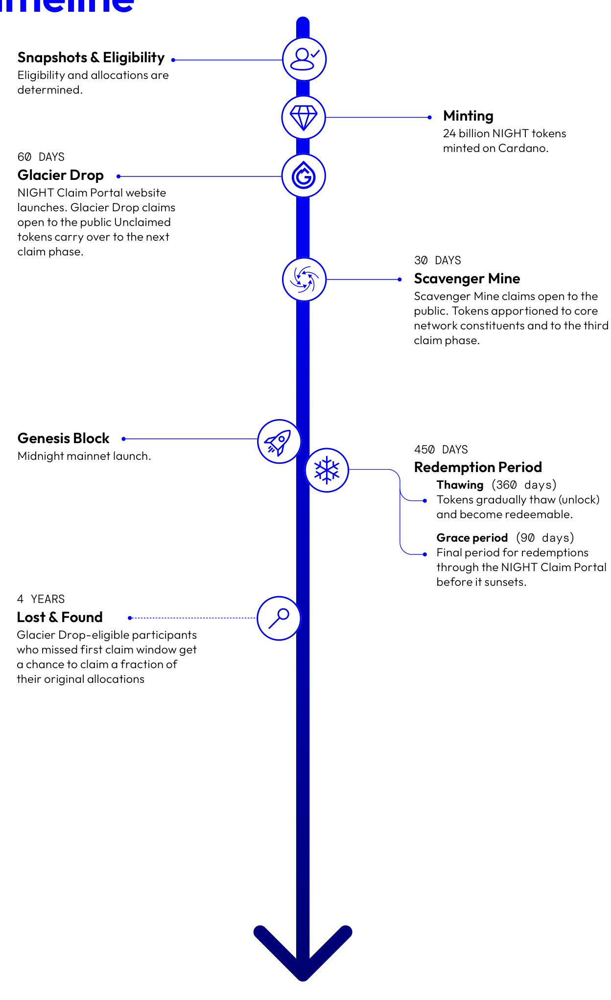

3.    Accounting for subsidy rate $(S)$ and block utilization $(U)$ determine the shares of the base reward – the actual reward – that go to block producers $(N_{_a})$ and Treasury $(N_{_{t}})$ :  

$$
N_{a}=\ N_{b}\;\,x\;\,\left[S+\left({\cal I}-S\right)x\;{\cal U}{\cal J}\right.
$$  

$$
N_{t}=\textsf{N}_{b}~-~N_{a}
$$  

4.    Update the outstanding number of tokens in the Reserve $\scriptstyle(B_{_o})$ to account for the distribution of that block’s base reward $(N_{_{b}})$ .  

This system achieves a fully predictable distribution of rewards, split between block producers and on-chain Treasury, while at the same time incentivizing maximum transaction inclusion within a block.  

# 6. NIGHT token distribution  

The initial distribution of the native crypto asset that grants access, utility, and control over the network is a fundamental component of any blockchain system. In the case of Midnight, this asset is the NIGHT token. The values and attributes of this distribution are a precursor to, and exert a strong influence on, the long-term future of any project; therefore, it’s crucial that they reflect the values and vision behind Midnight. The distribution of NIGHT tokens is designed to be:  

$\rightarrow$ Broad: the NIGHT distribution shall empower a broad community with the means to access, operate on, and contribute to Midnight. No single party or group shall exert overwhelming influence over the network.  

$\rightarrow$ Inclusive: the distribution shall be open to participants from Web3 and beyond, ensuring diversity on the network and establishing mutual interest and support between ecosystems.  

$\rightarrow$ Participative: the community shall have an active role in claiming the token supply and helping originate and seed the core constituents needed to operate the Midnight network.  

$\rightarrow$ Free:  tokens shall be allocated to the community of eligible participants at no cost.  

$\rightarrow$ Accessible: the claims process shall be simple and clear, and it shall give the community time to place their claims and redeem their tokens.  

$\rightarrow$ Transparent: The source code for smart contracts governing the operation of the distribution will undergo a comprehensive third-party security audit and shall be published and open-sourced.  

# Process overview  

The NIGHT token distribution will consist primarily of three claim phases and a redemption period.  

$\rightarrow$ Claim phase 1:  In the first phase, the Glacier Drop, $700\%$ of the total supply will be allocated to claims by the community of eligible participants based on criteria outlined in the corresponding subsection below. To broaden its reach and make up for the fact that, historically, token drops have had low participation, the Midnight token distribution implements two additional phases.  

$\rightarrow$ Claim phase 2: The second phase, Scavenger Mine, will allow any prospective participant to play a role in the process of originating and seeding Midnight’s core network constituents by providing computing power to solve computational tasks aiding in the launch of the network. During this process, $700\%$ of the unclaimed tokens from the Glacier Drop phase will be processed and apportioned between participants, core network constituents, and the third claim phase, as described below.  

$\rightarrow$ Claim phase 3: The third and final claim phase will take place sometime after the Midnight mainnet launches: Lost-and-Found. Eligible Glacier Drop participants will be given another chance to claim a fraction of their original allocation.  

$\rightarrow$ Redemption period: To complete the process and receive their NIGHT token allocations claimed, successful claimants will also have to redeem them – i.e., transfer them from a redemption smart contract to an eligible destination address supplied when making their claim.  

The distributed nature of the token distribution’s technical setup means that the process will be run and validated by a group of multiple organizations and entities, strengthening the decentralization and security of the entire process.  

# Participants’ liabilities  

The distribution of NIGHT tokens is not intended as a form of payment and has no implied real-world value (other than future application for chain utility).  The distribution does not involve the sale of NIGHT tokens or the raising of proceeds. Eligible participants must accept the terms and conditions of the distribution in order to complete the journey and redeem their allocated NIGHT tokens. All legal and tax implications associated with the distribution’s activities are the participants’ sole responsibility, according to their jurisdiction and specific situation.  

# Claim phase 1: Glacier Drop  

Duration: 60 days  

# Overview  

An evolution of the traditional airdrop formula, where tokens are merely dropped into eligible users’ wallets, the Glacier Drop includes mechanisms to increase its fairness, systemic integrity, and resistance to exploits by malicious parties. These mechanisms include the gradual thawing (unlocking) of claims, which inspires the Glacier part of its name.  

Before the outset of the Glacier Drop claim period, eligibility will be determined and allocations calculated based on token balances in addresses across all participating networks. To mitigate the risk of exploits, a random date/time has been selected, at which a snapshot of each participating network (Cardano, Bitcoin, Ethereum, XRPL, BNB, Solana, Avalanche, and Brave) has been taken to determine eligible addresses and their NIGHT allocations. This random historical snapshot will be used to mitigate insider information and reduce the risk of malicious parties gaming the distribution.  

During Glacier Drop, claimed tokens are allocated to eligible claimants, but are initially frozen (locked) in a redemption smart contract on the Cardano network , and will not be transferable before they gradually thaw (unlock) during the Redemption period, as described in more detail below.  

After Glacier Drop, the distribution then moves onto the second claim phase.  

# Eligibility  

Initial eligibility to Glacier Drop is extended to participants in some of the most well-established Web3 ecosystems. Eligible ecosystems were selected for their contributions to the evolution of blockchain technology, decentralized applications, and to help build the Midnight ecosystem with a diverse and experienced community from the outset.  

Individual eligibility is assessed on the basis of control over blockchain addresses within eligible ecosystems, using purely on-chain data; no personally identifiable registration is required, and no nonpublic personal information (NPI) is required to participate (although the option to sign up for a mailing list may be offered). The same person may claim using multiple qualifying addresses. Addresses may be eligible for the claim if they meet the following criteria:  

1. Eligible ecosystems: addresses pertaining to any of the following networks/projects: Cardano, Bitcoin, Ethereum, Solana, XRPL, BNB Chain, Avalanche, and Brave. The same user may claim against multiple qualifying addresses.  

2. Minimum balance: at the time of the snapshot, the address shall hold the equivalent value of at least 100 USD in native tokens of the respective network (ADA, BTC, ETH, SOL, XRP, BNB, AVAX, and BAT). Token prices will be assessed based on the rates on CoinMarketCap7 at the time of the snapshot. This mitigates potential Sybil attacks and similar bot activity exploits.  

3. Unsanctioned: blockchain addresses matching those listed on the Specially Designated Nationals (SDN) list of the US Department of the Treasury’s Office of Foreign Assets Control (OFAC) – based on assessment by a reputable blockchain forensics provider, such as Chainalysis8 – are not eligible for the claim.  

4. Community protection: addresses that, as determined by the Midnight TGE, do not pose undue burden or harm to the Midnight community or its ecosystem.  

# Allocation sizes  

During Glacier Drop, $700\%$ of the total supply of 24 billion NIGHT tokens will be made available to be claimed by eligible addresses on a per-network, native-token-balance-weighted basis.9  

# Network allocations  

The amount of NIGHT allocated to each network will be allotted as follows:  

$50\%$ of the total supply allocated to Cardano participants ▪ $20\%$ of the total supply allocated to Bitcoin participants The remainder of the total supply will be divided among the remaining qualifying networks in proportion to the relative USD value of the token holdings (as per CoinMarketCap data) of eligible participants at the snapshot.  

# Individual allocations  

Individual allocation sizes will be weighed based on address balances captured by a historical snapshot of each network taken before the publication of this paper. The number of NIGHT tokens allocated to each participating address is determined as follows:  

1. Let $(S_{_j})\mathsf{b e}$ the number of NIGHT tokens allocated to a specific participating network (j) out of the total NIGHT supply (S);   
2. Let $(V_{\iota})$ be the number of eligible native tokens that a single qualifying address (i) holds on that same blockchain network (j);   
3. Then $(\Sigma~V_{i})$ is the total number of eligible native tokens held by all qualifying addresses on that network $(j)$ ;   
4. Then, the NIGHT token allocation $(N_{_{i}})$ (denominated in STAR, the smallest subunit that makes up one NIGHT) to a qualifying address $(i)$ on network $(j)$ can be calculated using the following formula: $N_{i}\ =\frac{V_{i}}{\sum V_{i}}\,\ast S_{j}$   
5. Any remainder from this calculation will be left unclaimed and mined during the second phase;   
6. Repeat steps (1) through (5) for each qualifying address on each participating network.  

# Mechanics: exercising claims  

When the distribution window opens, the NIGHT Claim Portal – a website dedicated to claims – will be published. Detailed instructions on how to participate will be provided as each phase begins. Once the Glacier Drop claim period begins, eligible participants may exercise their claims by using that website to:  

1. Demonstrate custody over their respective eligible blockchain addresses by signing a message using their private keys.   
2. Provide an unused Cardano address (i.e., with no previous transaction history at the time of the claim) to serve as the destination address for receiving the redeemed NIGHT tokens. This is best practice and works to protect the personal data of claimants.  

# Tokens under third-party custody  

Users whose tokens are under the custody of a third party (e.g., held by a centralized exchange or other custodian) will not be able to participate in Glacier Drop directly, as they cannot access the private keys needed to demonstrate ownership of qualifying assets. These users should contact their custodians to confirm whether they will support the NIGHT token distribution. Custodians may, at their sole discretion, choose to participate and distribute the claimed NIGHT tokens among those on whose behalf they hold assets in custody.  

# Auditability  

Multiple measures are being taken to ensure the claim process is executed in the way that it is documented.  

$\rightarrow$ Code audit: The source code of the smart contracts governing the operation of the distribution will undergo a robust third-party security audit and shall be published and open-sourced by the Midnight Foundation.   
$\rightarrow$ Data integrity: A clear chain-of-custody (using digital signatures) process ensures claim snapshot data integrity, consistent with the defined steps and criteria.   
$\rightarrow$ Verification and proofs:  Submitted claims will undergo transaction correctness verification, through $700\%$ committee consensus by multiple blockchain ecosystem operators (unaffiliated with the Midnight TGE). Proof of processing is recorded on the Cardano blockchain.  

Censorship-resistance: The process will be  operated on chain via Cardano smart contracts.  

# Claim phase 2: Scavenger Mine  

Duration: 30 days  

The second phase, Scavenger Mine, will take place after Glacier Drop and before mainnet launch. It will offer participants the opportunity to play a role in the process of originating and seeding Midnight’s core network constituents, thus claiming a share of all unclaimed tokens from the Glacier Drop phase.  

The Scavenger Mine phase will involve completing a computational task or puzzle, designed to be accessible to the general public and not favor mining companies. Scavenger Mine expands the NIGHT token distribution’s eligibility requirements and gives the opportunity to an even broader swath of the internet to take part in the creation and future development of Midnight.  

During Scavenger Mine, $700\%$ of the tokens that were left unclaimed during Glacier Drop will be processed and apportioned. A share of the unclaimed Glacier Drop tokens will be allocated for claiming by Scavenger Mine participants, while the remainder will be apportioned to seed the core Midnight network ecosystem constituents – who are integral to the launch and operation of the network – and to the third claim phase.  

The 30-day process will be divided into 30 one-day slots, each beginning at 0:00 UTC. The pool of unclaimed tokens will be split into 30 equal daily portions, and rewards will be calculated and allocated at the end of each day.  

NIGHT tokens claimed by Scavenger Mine participants will initially be frozen (locked) in a redemption smart contract on the Cardano network in the same fashion as Glacier Drop-claimed tokens. These tokens will be redeemable in the same manner – and subject to the same thawing schedule – as those claimed during Glacier Drop.  

# Eligibility  

To be eligible to participate in the Scavenger Mine, participants must successfully complete and provide cryptographic proof of solution to computational tasks or puzzles requiring computing power. The puzzles will be carefully designed to ensure accessibility to the general public and prevent concentration of rewards among large mining operators.  

Prospective participants do not need to have participated in (or meet the eligibility criteria set for) the Glacier Drop phase – although Glacier Drop participants are also welcome to participate in this phase.  

# Allocation sizes  

During Scavenger Mine, $700\%$ of the unclaimed supply of NIGHT tokens will be carried over from Glacier Drop to be processed and apportioned between Scavenger Mine participants, core network constituents, and the third claim phase. The share of the tokens apportioned to Scavenger Mine claimants and to each of the constituents is variable, and depend on the uptake of the first claim phase.  

1. Let S be the total supply of NIGHT tokens;  

2. Let $\Game$ be the number of tokens claimed during Glacier Drop;   
3. Then, the share of unclaimed tokens from the total supply, available for processing and apportioning during Scavenger Mine S will be:  

$$
S_{\scriptscriptstyle u}~=~S-G
$$  

# Phase rewards apportionment  

The number of tokens from the Glacier Drop-unclaimed, carried-over tokens apportioned as rewards to participants in the Scavenger Mine phase will amount to a minimum of $7\%$ of the total supply S, so that there is always a share of tokens available to Scavenger Mine participants. An equal number of tokens will be earmarked for the next claim phase, Lost-and-Found.  

1. Let Ar be the total amount of tokens apportioned as rewards to Scavenger Mine participants;  

2. Then, in relation to the total supply $S$ , and to the tokens claimed during Glacier Drop G,  

$$
A_{r}\ =\ m a x\bigl(\frac{S}{100},\frac{S}{10}\ -\ \frac{G}{2}\bigr)
$$  

3. And then, the corresponding total amount of tokens allotted to the core network constituents $\mathsf{A}_{c}$ will be:  

$$
A_{\underline{{{c}}}}\;\;=\;\;S_{u}-A_{r}
$$  

The token supply available for core network constituents $\mathsf{A}_{c}$ will be apportioned among those as per the corresponding subsection below.  

# Individual allocations  

Individual participants will be allotted a share of the NIGHT tokens apportioned on a daily basis as Scavenger Mine rewards in proportion to the amount of computational work units they complete out of the total number of work units completed by all Scavenger Mine participants in a given day. Individual allocations will be calculated as follows:  

1. Given the total amount of tokens apportioned as rewards to Scavenger Mine participants in a given day $\mathsf{A}_{r}$ ;   
2. Let $C_{m}$ be the share of computation that a participant m provided in relation to total computation $C$ on that given day;   
3. Then, the number of tokens that a participant m will receive as reward $\mathsf{R}_{_m}$ will be:  

$$
R_{_{m}}=\ A_{_{r}}\ x\ \frac{C_{_{m}}}{C}
$$  

# Core network constituents apportionment  

As part of the ecosystem origination and seeding mechanism, for every Scavenger Mine allocation to a participant, a share of the carried-over unclaimed Glacier Drop tokens will be apportioned to the core Midnight network constituents and to the third claim phase. This fundamental process is a function of the rate of claims during the Glacier Drop phase and it is executed as the Scavenger Mine draws to an end.  

After Scavenger Mine rewards are accounted for, network constituents’ share Awill be distributed as follows:  

<html><body><table><tr><td>Token Distribution</td><td>Constituent</td></tr><tr><td>35% ÷ A</td><td>Midnight Foundation, a pool of NlGHT tokens willbe allocated to supporting the growth of the ecosystem and its further development.</td></tr><tr><td>30% ÷ A</td><td>Reservel°, a pool of NiGHT tokens held and governed autonomously by the Midnight protocol, whose only function is to issue block production rewards to block producers ontheMidnightnetwork.</td></tr><tr><td>10% ÷ A</td><td>Midnight TGE, a pool of NIGHT tokens will be reserved for commercial partnerships to provide bereturned totheReserve ata laterdate.</td></tr><tr><td>5% ÷ A</td><td>On-chain Treasury, a pool of NIGHT tokens, stored in the ledger, belonging to the protocol and initially protocol-locked,with a viewtobeing subject tothe control of the decentralized on-chain projects that are selected via governance mechanics.</td></tr><tr><td>A</td><td>Lost-and-Found, claim phase token pool. The amount of tokens available to this phase will be the same as the amount of tokens apportioned as rewards for Scavenger Mine participants.</td></tr></table></body></html>

10  In case claims during Glacier Drop are such that the sum of all subsequent allotments surpass $100\%$ , then the amount of tokens apportioned to the Reserve will be reduced by the excess amount.  

For example: if $70\%$ of the total supply are claimed during Glacier Drop, then, from the total allotment reserved to core network constituents during the Scavenger Mine phase, tokens will be apportioned as follows:  

$\rightarrow$ 41.18% to the Midnight Foundation;   
$\rightarrow\ 35.29\%$ to the Reserve;   
$\rightarrow$ 11.76% to the Midnight TGE;   
$\rightarrow\ 5.88\%$ to the on-chain Treasury;   
$\rightarrow\ 5.88\%$ to participants in the Lost-and-Found claim phase;  

# Mechanics: exercising claims  

To be eligible, participants must use the same NIGHT Claim Portal website as during Glacier Drop to:  

1. Demonstrate successful completion of one or more computational tasks by providing cryptographic proofs of the solutions.   
2. Provide an unused Cardano address (i.e., with no previous transaction history at the time of the claim) to serve as the destination address for receiving the redeemed NIGHT tokens. Participants who also took part in Glacier Drop can enter the same Cardano address they provided during the previous phase as long as it has no on-chain activity.  

Like Glacier Drop, detailed instructions on how to participate in Scavenger Mine will be published on the NIGHT Claim Portal. The end of the Scavenger Mine phase will constitute the end of the period during which participants may claim tokens in the token distribution described in this whitepaper via the NIGHT Claim Portal.  

# Genesis block and mainnet launch  

At the end of the Scavenger Mine period, the Midnight genesis block will be created and the Midnight mainnet will be launched. Prior to the launch of the Midnight mainnet, the Midnight network's codebase will be made open-source.  

# Redemption period and thawing  

Duration: 450 days  

Once mainnet launches, the Redemption period begins, during which each Glacier Drop and Scavenger Mine distribution thaws (unlocks) following a four-installment staggered schedule over the course of 360 days. The date of the first installment is randomly determined to fall over a range of 1-90 days), with subsequent installments following every 90 days. Token unlocks happen in equal $25\%$ shares at each thaw.  

This design mitigates the chances of supply shocks or sudden spikes in token flows that may distort supply-and-demand market dynamics, thus preventing manipulation of the token’s circulating supply during the early days of the network.  

The exact date of the first unlock depends on a random number that is generated and assigned to each claim upon successful submission of the claim before the Redemption period starts. For example:  

A day-1 schedule would unlock $25\%$ of the tokens on days 1, 91, 181, and 271. A day-25 schedule would unlock $25\%$ of the tokens on days 25, 115, 205, and 305.   
A day-90 schedule would unlock $25\%$ of the tokens on days 90, 180, 270, and 360.  

Any residual amounts (in case the number of tokens is not divisible by four) will be allocated to the last cycle. The thaw schedule count starts from the genesis block (day zero).  

# Redeeming claims  

Successful Glacier Drop and Scavenger Mine claimants may use the NIGHT Claim Portal to redeem their NIGHT tokens as they unlock, following the schedule outlined above. Claimants may choose to redeem each share of their allotted tokens as they thaw, or wait until their tokens fully unlock to redeem the whole allotment at once. Each transfer of NIGHT tokens from the redemption smart contract will require that the claimant pays a Cardano network fee (as described in the subsection below). At the beginning of the Redemption period:  

$\rightarrow$ NIGHT tokens that have been claimed in the Glacier Drop and Scavenger Mine phases will become freely transferable as they thaw (unlock).   
$\rightarrow$ NIGHT tokens allotted to the  Midnight TGE and the Midnight Foundation will be immediately transferable and capable of being used in pursuit of advancing the development of the Midnight ecosystem.   
$\rightarrow$ NIGHT tokens allotted to the Reserve will be held and controlled by the protocol itself, and will not be transferable except as block production rewards following the rules described in the corresponding section.   
$\rightarrow$ NIGHT tokens allotted to the Treasury will be stored in the ledger, owned by the protocol, and initially locked, with a view to being unlocked when the expected on-chain decentralized governance mechanism for the Midnight network is implemented.   
$\rightarrow$ NIGHT tokens claimed in the Lost-and-Found phase will not be subject to thawing (lockup) and will be immediately transferable.  

# Cardano transaction fees  

NIGHT tokens are distributed for free. However, the redemption of Glacier Drop and Scavenger Mine claims requires that claimants execute a transaction on the Cardano network. Each such transaction incurs a nominal network transaction fee to be paid in Cardano’s native token, ADA.  

Cardano does not have a single, fixed transaction fee. Instead, the minimum fee for any given transaction is calculated using a formula defined by the protocol. For a typical simple transaction on Cardano, as of April 9th, 2025, the minimum transaction fee is around 0.16 to 0.17 ADA – around USD $\pounds0.09$ as of that same date. Further details on Cardano fees can be found at the Cardano documentation website11.  

# NIGHT Claim Portal sunsetting  

The Redemption period concludes with a 90-day grace period during which the NIGHT Claim Portal website will remain operational, allowing redemptions to continue beyond the thawing of the last tokens. Following this period, the NIGHT Claim Portal will cease to be operational, and participants in Glacier Drop and Scavenger Mine who have not yet redeemed their tokens will have to use their own means to interact with the smart contracts on the Cardano network to do so.  

# Claim phase 3: Lost-and-Found  

Duration: four years (or until all remaining tokens are claimed)  

The Lost-and-Found phase will begin sometime after the Midnight mainnet launches, giving original Glacier Drop-eligible participants (who did not claim during the initial 60-day claim period) another chance to claim a fraction of their original allocations. Participants claiming during this phase will have to use their own means to interact with the Midnight network smart contract that will hold their allocated tokens, and to submit and process their claims. Unclaimed tokens after the four-year period will be reallocated to the on-chain Treasury.  

# Eligibility  

To be eligible for the Lost-and-Found phase, participants must have met all the eligibility criteria for the Glacier Drop phase and must not have claimed their allocations during the original Glacier Drop claim period.  

# Allocation sizes  

Lost-and-Found allocations will be a fraction of the original and are based on the same historical snapshots taken to determine eligibility for the Glacier Drop claim phase. As with the Scavenger Mine phase, a minimum of $7\%$ of the total supply will be earmarked for Lost-and-Found participants.  

# Phase allocation  

The amount of tokens available for the Lost-and-Found phase will be the same as the amount distributed to participants in the Scavenger Mine phase.  

# Individual allocations  

Lost-and-Found rewards will be calculated based on the size of the pool of Lost-and-Found tokens. Individual allocations will be apportioned in proportion to each claiming address's original Glacier Drop allocation in relation to the sum of all Glacier Drop-unclaimed allocations – using a transformation function to balance the distribution across the set of eligible addresses.  

# Mechanics: exercising claims  

Participants will have to input proof of ownership of a Glacier Drop participating address to a smart contract hosted on the Midnight network. This proof will unlock the Lost-and-Found claim associated with that address, allowing the immediate transfer NIGHT to a destination Midnight address of their choosing. This transaction will be supported (paid) by DUST owned by the Lost-and-Found smart contract. No further support or resources – such as the NIGHT Claim Portal website – are anticipated to be provided to facilitate this phase.  

# Timeline  

  

# 7. Glossary  

<html><body><table><tr><td>Term</td><td>Definition</td></tr><tr><td>Circulating NIGHT</td><td>All NiGHT tokens that do not belong to the Reserve (and thus, not considered uncirculated),including those belonging tothe community andothercorenetworkconstituents.</td></tr><tr><td>DUST</td><td>The shielded, renewable resource on the Midnight network that is used to access network</td></tr><tr><td>Glacier Drop</td><td>The first phase - and sometimes also used as the namesake - of themulti-phaseNlGHTtokendistribution.The GlacierDrop makes1Oo%of thetotal NIGHT token supply available to be claimed by eligible participants across the Cardano,</td></tr><tr><td>Lost-and-Found</td><td>Bitcoin, Ethereum, Solana,XRPL,BNB,Avalanche,and Brave networks. The third phase of the NIGHT token distribution.</td></tr><tr><td>NIGHT</td><td>Midnight's native token, whose primary function is to generate DUST, the resource that powers network operations. It will also be used for block production rewards,</td></tr><tr><td>Proof-of-Stake/PoS</td><td>ecosystem growth incentives, and on-chain governance. PoS is a consensus mechanism used in blockchain technology where users validate transactions on a network by "staking" a certain amount of cryptocurrency they hold.</td></tr><tr><td>Reserve</td><td>Midnight is a PoS-type blockchain.</td></tr><tr><td></td><td>tokens are considered uncirculated. The second phase of the NIGHT token distribution.</td></tr><tr><td>Scavenger Mine SPECK</td><td>One unit of DUST is further divided into one million subunits called SPECK.</td></tr><tr><td>Stake Pool Operator/ SPO</td><td>A participant in a proof-of-stake blockchain network responsible for configuring and maintaining thenodeinfrastructurethatvalidatestransactions,producesnew</td></tr><tr><td></td><td>blocks, and secures the network, often on behalf of other token holders (delegators). OneunitofNlGHTisfurtherdivided intoonemillionsubunitscalledSTAR.</td></tr><tr><td>STAR</td><td></td></tr><tr><td></td><td></td></tr><tr><td></td><td></td></tr><tr><td></td><td></td></tr><tr><td></td><td></td></tr><tr><td></td><td>NIGHT tokens held by the Reserve and earmarked for block production rewards.</td></tr><tr><td></td><td></td></tr><tr><td></td><td></td></tr><tr><td>Treasury/ on-chain Treasury</td><td>A pool of tokens that is reserved for ecosystem development purposes and is</td></tr><tr><td></td><td></td></tr><tr><td></td><td>governed via on-chain voting.</td></tr><tr><td>Uncirculated NIGHT</td><td></td></tr><tr><td></td><td></td></tr><tr><td>Unlocked NIGHT</td><td></td></tr><tr><td></td><td>Unlocked NlGHT tokens can be moved by their holders and carry full utility.</td></tr><tr><td></td><td></td></tr><tr><td></td><td></td></tr><tr><td></td><td></td></tr><tr><td></td><td></td></tr><tr><td></td><td></td></tr><tr><td></td><td></td></tr><tr><td></td><td></td></tr><tr><td>Zero-knowledge / ZK</td><td></td></tr><tr><td></td><td></td></tr><tr><td></td><td></td></tr><tr><td></td><td></td></tr><tr><td></td><td></td></tr><tr><td></td><td></td></tr><tr><td></td><td></td></tr><tr><td></td><td></td></tr><tr><td></td><td></td></tr><tr><td></td><td></td></tr><tr><td></td><td>A cryptographic techniquethat allows one party to prove something toanother</td></tr><tr><td></td><td></td></tr><tr><td></td><td></td></tr><tr><td></td><td>without revealing any additional information.Zero-knowledge proofs (ZKPs) are used to verify information while keeping it private.</td></tr></table></body></html>  

# midnight  