# TCoourntneriangd thoe  neCw aagse ohf Aal ctroessr-nchaaint iwvorleds  

The protocols competing for the Tornado Cash user base  

# Executive Summary  

On August 8th 2022, the US Treasury Department’s Office of Foreign Assets Control (OFAC) sanctioned the popular Tornado Cash decentralized mixer. Processing over $\mathbb{S}7$ billion worth of cryptoassets throughout its operation, Tornado Cash was used by criminal entities – including North Korea’s “Lazarus Group” state cyberhackers – to launder over $\mathbb{S}1.54$ billion of illicit cryptoassets.  

Within a month of the sanctions, Tornado Cash liquidity pools decreased by approximately $60\%$ – reducing its anonymizing potential for large-scale money laundering schemes. This briefing note details Elliptic’s analysis into six prominent alternative Ethereum-based obfuscation protocols that have been mentioned as potentially the next Tornado Cash.  

The briefing concludes with a risk matrix – devised by Elliptic’s internal investigators – on the threats posed by these services based on a number of indicators. The matrix aims to inform virtual asset services and criminal investigators on the likely risks and trends ahead.  

We have found that:  

Numerous protocols are competing for the vast user base that Tornado Cash once had. Six such protocols discussed in this briefing have mixed over $\mathfrak{s}41.5$ million worth of cryptoassets to date $-\,0.6\%$ of the amount mixed by Tornado Cash.   
However, only $\Phi40,\!000$ (0.1%) of these funds have originated from thefts – indicating minor criminal use at this stage. A further $\mathbb{\Phi}{\sf l00},000$ originates from Tornado Cash itself – a small proportion of which was sent after sanctions were imposed.   
Many protocols are based on “improved” forks of the Tornado Cash smart contract, though still suffer from small liquidity pools that make large-scale mixing less feasible.   
Aspiring replacement mixers are typically active on Ethereum, Binance Smart Chain and Polygon. Stablecoins such as Tether (USDT), Binance USD (BUSD) and USD Coin (USDC) are also usually supported.   
There is a growing market for decentralized finance (DeFi)-based privacy solutions that allow traders to conceal their investment strategies. There have been efforts by such protocols in particular to incorporate anti-money laundering solutions to avoid the same fate as Tornado Cash.   
The post-Tornado crypto privacy industry is beleaguered with often hostile competition, with numerous protocols denouncing each other’s technology as ineffective and trying to de-mix their transactions.  

# The Alternatives  

# RAILGUN  

What is it? RAILGUN is a decentralized protocol purportedly aimed for professional traders and DeFi users who wish to conceal their investment strategies. When using the RAILGUN Privacy System, wallet addresses are removed from transactions on openledger blockchains using Zero-Knowledge proof technology (zk-SNARKs). Users can obtain a report of their transactions if they wish, for example for tax reporting purposes. RAILGUN claims to be compatible with all standard ERC-20 tokens and has a wallet provider named Railway that has their features built-in.  

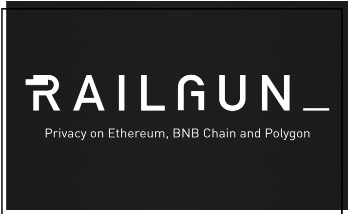  

“The goal of RAILGUN is not to strip away the third-party verifiability of actions taken on-chain, but rather to give back to users the power to choose who sees what, when, and why.”  

In their own words – RAILGUN (www.railgun.org)  

# Buccaneer V3 (BV3)  

What is it? A new token (BUCC) on the Ethereum blockchain that allows funds to be “buried” instantly for as long as desired without the need to mix, pool or cycle transactions. It also has a “decoy mode” that displays fake and changing BUCC balances on wallet provider interfaces as an added obfuscation technique.  

Transaction fees are paid in BUCC rather than ETH through a “Gas Station Network” (GSN), which takes a small proportion of BUCC being transferred as fees. BV3 therefore claims that it solves the “funding problem” – the issue that addresses typically need to source ETH to pay transaction fees, typically from a centralized KYC exchange. This feature is likely to be attractive to illicit wallets that do not wish to interact with AML-compliant entities to source crypto. BV3 is highly critical of Railgun (and vice versa), allegedly de-anonymizing one of their transactions in a bid to disprove their technology.  

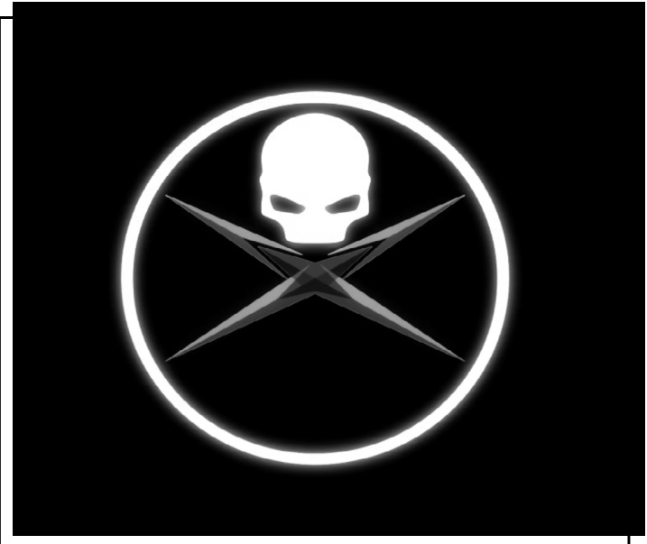  

“BV3 is the first cryptocurrency which is not only censorship- resistant, but also regulation-resistant. Fiat ramp control and KYC measures do nothing to impede the use of BV3.”  

In their own words – Buccaneer V3 (t.me/BuccaneerV3)  

White Ethereum  

What is it? A mixer otherwise known as “White Wash ${\mathsf{E T H}}^{\prime\prime}$ . This service provides anonymity by allowing users to place ETH into a pool, then withdraw the ETH anonymously to any wallet of their choice – similar to Tornado Cash.  

Deposits are capped at five ETH – as opposed to Tornado Cash’s 100 ETH. The developers periodically deploy new contracts – with the same underlying concealed code – to undertake mixing activities. The contracts managing the five ETH deposits are allegedly capable of blocking wallets identified as associated with hacks or thefts.  

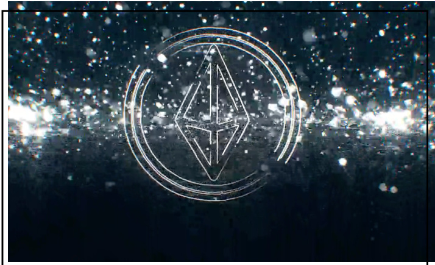  

“White ETH believes privacy and anonymity should be at the core of all cryptocurrency projects. The goal of White ETH is to make privacy $\pmb{\&}$ anonymity universally available, and affordable, regardless of transaction size.”  

In their own words – White Ethereum (www.whiteethereum.com)  

# 0xTIP  

What is it? 0xTIP is a mixer and bridge that works only with 0xMonero (0xMR), a token available on nine different blockchains. 0xMR is integrated with the Incognito privacy wallet and can be used on some online casinos. The 0xTIP mixer functions as a Telegram bot that claims to use off-chain transactions, stealth addresses, bulletproofs, ring signatures and a bridge relayer. It is capable of bridging 0xMR from Ethereum to BNB.  

On-chain data indicates that usage of 0xTIP is very low, with the highest deposit worth just $\mathbb{S}177$ In September 2022, the developers admitted that low liquidity meant that users were struggling to mix even $\mathfrak{s l00}$ – an issue that they previously argued made them “not a good tool for money launderers”. The developer team has no relation to Monero (XMR) or its user community, with which they are competitors and have been accused of smearing their project.  

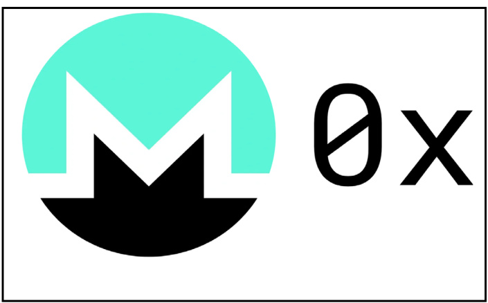  

“We are not crypto anarchists, we are realists who understand that there are always those who seek to persecute and control others for their own personal gain.”  

In their own words – 0xMonero (www.0xmonero.com)  

Messier 87 Black Hole  

What is it? This platform is a cryptoasset mixer – described as an “improved fork of Tornado Cash” – and touted as a privacy solution for DeFi investors.  It is active on the Ethereum, Binance Smart Chain and Polygon blockchains. Users obtain a “note” that proves ownership of deposited assets, which can also be used to generate a compliance report. Developers have confirmed that they will provide users’ compliance reports – essentially “de-mixing” clients’ transactions – if required to do so by a subpoena.  

Users are also incentivised to wait before withdrawing their deposited assets through a rewards system, which is designed to ensure maximum liquidity in the anonymity pool. Like Tornado Cash, users can deposit as much as 100 ETH/BNB or 100,000 MATIC/USDC/ BUSD at once. Black Hole is one of many applications provided by Messier 87 designed to provide privacy, but is currently offline pending a major update to “Version $2.0^{\prime\prime}$ .  

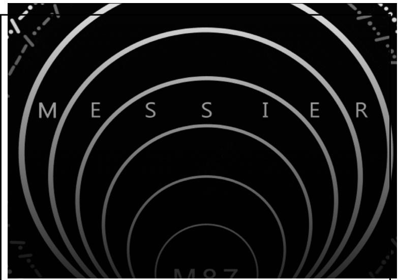  

“For far too long have we witnessed the exploitation of personal data, financial hardship of the public and the deliberate decimation of all forms of liberty. We cannot and will not stand by idly any longer!”  

In their own words – Messier 87 Black Hole (www.messier.app)  

# Cyclone Protocol  

What is it? Cyclone Protocol is another Tornado Cash fork that claims to provide numerous enhancements, such as yield generation opportunities when funds are contributed to the anonymity pool. Cyclone is available on IoTEX, Ethereum, Binance Smart Chain (BSC) and Polygon. Like Tornado Cash and Messier 87, it supports the mixing of 100 ETH/100,000 USDT at once. It has a “KYC” certificate provided by an audit company, though the circumstances of its provision are vague.  

Cyclone also provides mixing services for TORN – the governance token of Tornado Cash – raising concern amongst users following the sanctions against it. Developers appear to have reduced their focus on the project since late 2021, with the protocol’s documentation, roadmap and social media becoming increasingly outdated.  

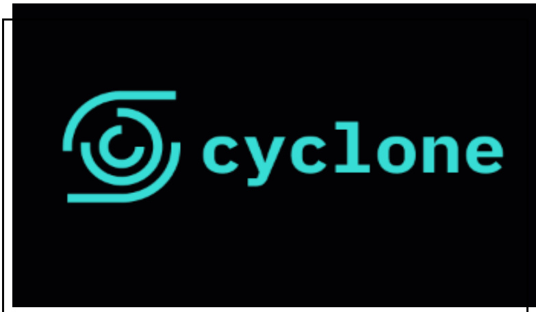  

“Anyone who knows that you own a particular address can quickly view your payments, trace the source of your funds, calculate your holdings, and analyze your on-chain activity. Cyclone is built to address these problems.”  

In their own words – Cyclone Protocol (www.cyclone.xyz)  

# Overall Trends  

Together, these obfuscation protocols have mixed over $\mathfrak{s}41.5$ million of cryptoassets. ETH, BNB, Wrapped ETH and USDT are the most commonly mixed assets, reflecting their popularity with DeFi-based investing. Note, however, that these figures and charts exclude Polygon-based assets.  

As Cyclone (100 ETH) and RAILGUN (no limit) have the highest mixing capacity of the tools analyzed, they make up more than three-quarters of the funds mixed by these services. White Ethereum, with a maximum mixing capacity of five ETH, and other protocols that are currently being tested or offline pending upgrades (Messier 87 and BV3) have processed significantly less.  

# Cryptoassets Processed by Tornado Cash Alternatives  

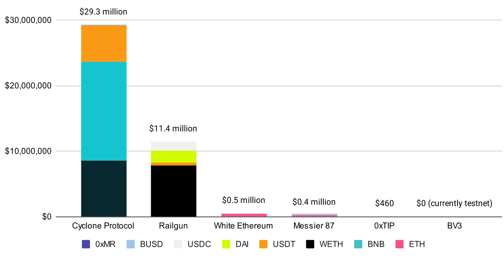  

The sources of funds being by these services – for now – largely reflect legitimate DeFi trading activity. However, a smaller $\Phi40,\!000-0.16\%$ of total – originates from DeFi thefts. This includes the xWIN Finance flash loan exploit of June 2021, which stole approximately $\mathbb{\Phi}270,000$ . Of those funds, $15\%$ (\$37,000) was laundered through Cyclone Protocol. A further $\mathbb{\Phi}{\sf l00},000$ originates from Tornado Cash, of which around $\Phi400$ was sent through Messier 87 a week after sanctions were imposed. Nevertheless, current activity indicates that large-scale criminal adoption of these protocols has not (yet) materialized.  

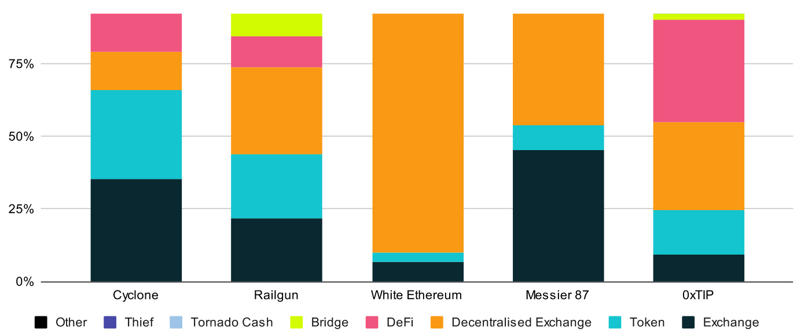  
Source of Incoming Cryptoassets by % Contribution  

# Conclusion  

Elliptic’s internal analysis identifies Cyclone Protocol as the highest risk amongst the Tornado Cash alternatives active today. Its high transaction limits, the relatively large liquidity of its mixing pools and its ability to mix the token of a sanctioned entity (TORN) makes it a cause for concern. It’s confirmed use to launder at least some proceeds of DeFi exploits, the large amount of funds it has since processed and the apparent absence of its developer team to address concerns only strengthen these risks.  

Also scored “medium-high” is Buccaneer V3, which has not addressed any AML concerns throughout its development. BV3 is unique to the other protocols as it takes the form of a token, rather than a service. A main mitigating factor of BV3, however, is that it claims to utilize technology that is currently being tested. Whether it lives up to the features and capabilities it has promised remains to be seen – with several rival obfuscation protocols casting doubt that it can.  

The remaining protocols all have mitigating factors arguably significant enough to ward off large-scale illicit use. RAILGUN, while popular, generates compliance reports and has a partially doxxed development team, meaning that it will likely comply with any investigations. Its technology has also been scrutinized by rivals. Messier 87, meanwhile, has actively stated that it will comply with subpoenas and provide such reports to authorities. Finally, White Ethereum and 0xTIP struggle with low mixing limits and low liquidity pools respectively, making them unviable replacements for Tornado Cash-level obfuscation at present.  

Elliptic will continue to monitor the post-Tornado obfuscation industry across Ethereum Virtual Machine (EVM)-compatible chains and update both virtual asset businesses and investigators when new risks emerge. To keep ahead of these risks and receive updates from Elliptic’s Research $\&$ Investigation Team, sign up to Elliptic Connect and stay updated with our weekly newsletter.  

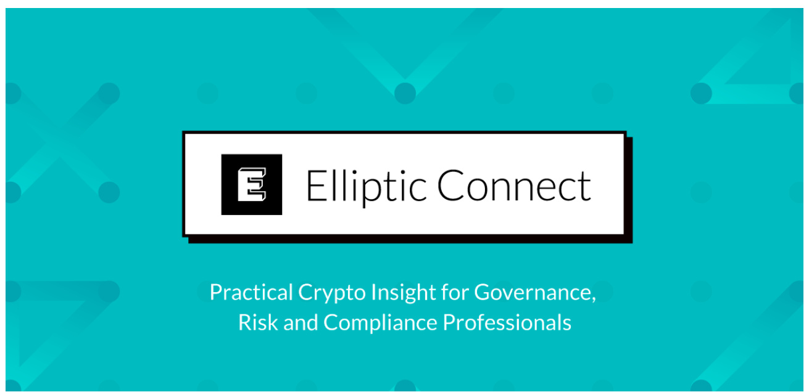  

<html><body><table><tr><td>Name Cyclone Protocol</td><td>CA, USA</td><td>Mar 2021</td><td>Established CYC</td><td>Token Market Cap $860k</td><td>18.3k</td><td>Social Media Followers $29.3m</td><td>Funds Mixed</td><td>Anonymous and inactive</td><td>13 assets (Ethereum,</td><td></td><td>Largest Mixing Pool (ETH) 100 ETH</td><td>High</td><td>Liquidity No</td><td>Generates Compliance Report? Capable of mixing TORN </td><td>N/A</td><td>Other AML Controls orMitigating Factors</td><td>$38k</td><td>Illicit Funds Mixed OverallRsk Rating High</td></tr><tr><td>Buccaneer</td><td>CA, USA</td><td>TBD</td><td>BUCC</td><td>N/A</td><td>1.0k</td><td>N/A</td><td></td><td>Anonymous</td><td>BNB,loTeX& Polygon) Currently on Rinkeby</td><td>N/A</td><td>N/A</td><td>No</td><td>(token of Tornado Cash) "Decoy"tools spoof token</td><td></td><td>Not yet released,</td><td>N/A</td><td>Medium High</td><td></td></tr><tr><td>V3 RAILGUN</td><td>WA,</td><td>Jan</td><td>RAIL</td><td>$32k</td><td>16.3k</td><td>$10.9m</td><td></td><td>Partially</td><td>Testnet ETH + AII</td><td>N/A</td><td>N/A</td><td>Yes</td><td>values Features built into“Railway"</td><td>N/A</td><td>undergoing testing</td><td><$2k</td><td>Medium</td><td></td></tr><tr><td></td><td>USA CA,</td><td>2021 Jun</td><td>M87</td><td>N/A</td><td>4.5k</td><td>$0.4m</td><td></td><td>paxxop Anonymous</td><td>ERC-20 tokens ETH, USDC,</td><td>100 ETH</td><td>Med</td><td>Yes</td><td>wallet Some funds</td><td></td><td>Will comply|<$1k</td><td></td><td>Medium</td><td></td></tr><tr><td>Messier 87 Black Hole</td><td>USA</td><td>2022 (offline)</td><td></td><td>N/A</td><td></td><td></td><td>$0.5m</td><td>Anonymous</td><td>BNB, BUSD, MATIC ETH (BNB</td><td>5 ETH</td><td>Med</td><td>No</td><td>originate from TornadoCash post-sanctions</td><td>with Sporadically</td><td>subpoenas Canblock</td><td>N/A</td><td></td><td></td></tr><tr><td>White Ethereum</td><td>MI, USA</td><td>inr 2022</td><td>WHITE</td><td></td><td>4.9k</td><td></td><td></td><td>Anonymous</td><td>coming soon) OxMR (on 9</td><td>N/A</td><td>Very</td><td></td><td>changes its contract addresses No</td><td>Bothamixer</td><td>walletsfrom 5 ETH mixing pool N/A</td><td>N/A</td><td>Medium Low</td><td></td></tr><tr><td>OxTIP</td><td>AZ, USA</td><td>inr 2022</td><td>0xMR</td><td>$132k</td><td>900</td><td><$500</td><td></td><td></td><td>blockchains)</td><td></td><td>Low</td><td></td><td>and bridge, accepted on some crypto casinos</td><td></td><td></td><td></td><td>Low</td><td></td></tr></table></body></html>  

# Other Reports by Elliptic  

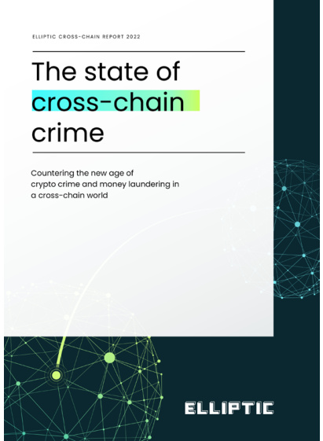  

# The State of Cross-chain Crime  

Blockchains have become increasingly interconnected. New technologies such as decentralized exchanges (DEXs) and cross-chain bridges have removed many of the barriers to the free flow of capital between cryptoassets. However they are also being abused for money laundering by the likes of ransomware groups and hackers, who are moving billions of dollars in crypto between assets and blockchains.  

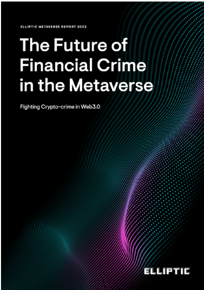  

# The Future of Financial Crime in the Metaverse  

This guide deep dives into financial crime typologies using metaverse-related cryptoassets, in order to arm compliance teams with a comprehensive set of warning signs and case studies on:  

Illicit activity involving cryptoassets in the metaverse.   
Examples of how these indicators fit into broader criminal behaviors.   
Context on how criminals engaged in these activities are working to clean their illicit funds.  

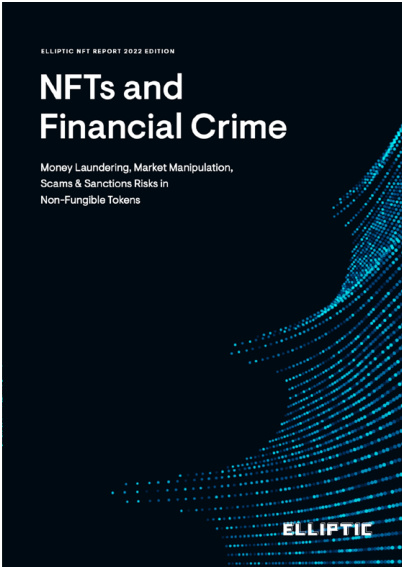  

# NFTs and Financial Crime  

This report provides and explains the latest NFT trends to understand their financial crime risks. Guidance is also provided on regulatory matters concerning NFTs and the utilization of blockchain analytics to detect, investigate and prevent exposure to illicit activity. The report is intended for all stakeholders engaging with NFTs. It provides red flag indicators and recommendations to improve the safety, security and enjoyment of partaking in this rapidly growing industry.  