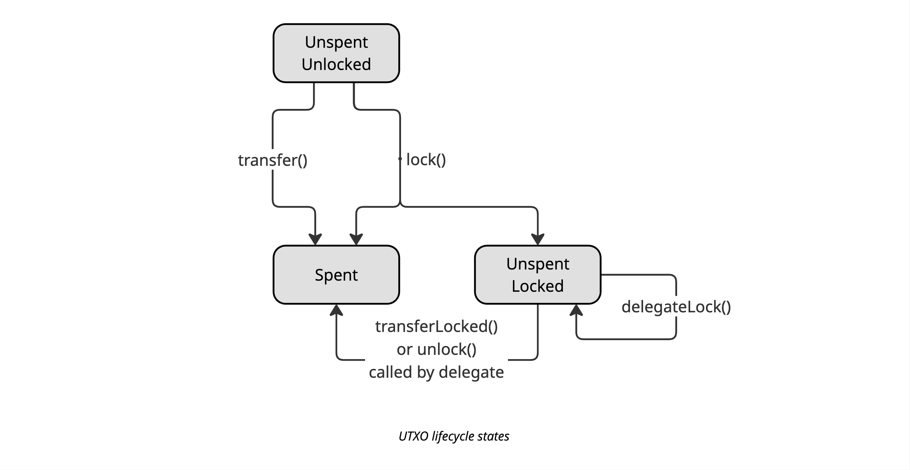

# Basic Concepts

Zeto is built on the following fundamental concepts.

## Onchain state model: UTXO

The smart contract for a token economy must maintain states onchain. There are two ways to model states: account vs. UTXO.

- The account model is very popular in the existing token standards such as ERC20/721/1155 etc. Each account is an entry in a map that the smart contract maintains, with the value being the account's state such as current balance, or list of assets. A transaction updates the states of one or more accounts.
- The UTXO model works very differently, by creating states that are independent to each other. Each UTXO state is in one of two modes: unspent or spent. A transaction consumes unspent states, at which point they become spent, and produces new (unspent) states. Each UTXO state specifies the spending rules that must be satisfied when a transaction attempts to spend it.

### UTXO for better parallel processing

The UTXO model is adopted for Zeto instead of the account model, for better support of parallel processing. Due to the necessity of maintaining private states offchain in order to achieve privacy, the client must continuously keep their private states in sync with the smart contract. Using an account model makes it more difficult to achieve this because incoming transfers from other parties would invalidate an account's state, making the account owner unable to spend from its account unless the private state has been sync'ed again. Solutions to this issue, often referred to as front-running, typically involve a spending window with a pending queue. One example of this is [Zether](https://eprint.iacr.org/2019/191), which describes an `epoch` construct with pending transaction queues to address the front-running problem. Using epochs results in limited parallel processing of transactions from the same spending account.

With a UTXO model, on the other hand, since each state is independent of the others, spending multiple UTXOs at the same time, even if they call come from the same owner, can be easily achieved.

### UTXO for better anonymity

With an account model, given that the states are mapped to the owning accounts in the onchain storage, there is an inherent challenge to anonymity, where checking which account was updated by a transaction would reveal the counterparties of a transaction. This could be mitigated by using anonymity sets, where more accounts besides the real sender and receiver of a transaction are updated with an encrypted zero value. However this increases the gas cost of transactions.

With the UTXO model, since each UTXO state describes its own ownership, in a masked form (`hash(value, owner public key, salt)`), there is no revelation of the owning account when a UTXO is spent or produced. Furthermore, the entitlement to spend the private UTXO token is demonstrated by the ZK proof, rather than the transaction signer (aka `msg.sender`). This allows Zeto transactions to be signed by any accounts. Zeto clients are encouraged to use one-time signing keys to submit transactions, such as those from an [HD wallet](https://en.bitcoin.it/wiki/BIP_0032).

## Commitments

Each UTXO is tracked by the smart contract as a hash of the following components: value (for fungible Zeto) or token Id (for non-fungible Zeto), owner public key and salt. These are called commitments. They serve several important purposes:

- Representing the existence of a Zeto token. A Zeto token's value is recognized only if it's commitment is known to the smart contract that maintains the token economy.
- Hiding the secret information about a Zeto token. The value or token Id and the ownership information are hidden behind the secure hash string, which can not be reverse-engineered back to the secerts.
- Acting as the public inputs for verifying ZK proofs. All Zeto transactions consume some existing UTXOs and produce some new UTXOs. For the smart contract to be convinced that a transaction is valid, a ZK proof must be provided that demonstrates a transaction proposal conforming to the policies of the specific token implementation. The commitment hashes are critical public inputs in almost all such ZK proof verifications.

## Finality

Each transaction's validity is verified by the smart contract before allowing the proposed input UTXOs to be nullified and the output UTXOs to come into existence. In other words, this is not an optimistic design and as such does not rely on a multi-day challenge period before a transaction is finalized. Every transaction is immediately finalized once it's mined into a block.
