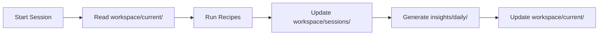

# Framework V2.0 - Sustainable Organization Proposal

## 🎯 Goals
- Support 100+ reports without confusion
- Clear progression tracking
- Easy handoff between sessions
- Automated organization

## 📁 Proposed Structure

```
privacy-agent/
├── 📦 sdk/                    # Core Product
│   ├── packages/
│   ├── examples/
│   └── dist/
│
├── 🤖 automation/             # Agent System
│   ├── recipes/
│   ├── scripts/
│   └── templates/            # NEW: Recipe templates
│
├── 📊 workspace/              # NEW: Active Work
│   ├── current/
│   │   ├── sprint.md         # Current sprint goals
│   │   ├── blockers.md       # Active issues
│   │   └── decisions.md      # Pending decisions
│   ├── sessions/             # Session continuity
│   │   └── 2025-10-23/
│   │       ├── morning.md
│   │       └── afternoon.md
│   └── memory/               # Agent state
│       ├── developer/
│       └── tester/
│
├── 📈 insights/              # NEW: All Reports & Analysis
│   ├── daily/
│   │   └── 2025/
│   │       └── 10-October/
│   │           └── 23/
│   │               ├── session-report.md
│   │               └── metrics.json
│   ├── research/
│   │   ├── market/
│   │   ├── competitors/
│   │   └── user-needs/
│   └── retrospectives/
│       └── sprint-1.md
│
├── 🎯 strategy/              # Strategic Documents
│   ├── active/
│   │   └── current.md -> v2-strategy.md
│   ├── roadmap/
│   │   ├── 2025-Q4.md
│   │   └── 2026-Q1.md
│   ├── decisions/           # Architecture Decision Records
│   │   ├── ADR-001-no-wallet-abstraction.md
│   │   └── ADR-002-privacy-cash-integration.md
│   └── archive/
│       └── 2025/
│
├── 📚 knowledge/            # NEW: Persistent Learnings
│   ├── patterns/
│   │   └── successful-recipes.md
│   ├── protocols/
│   │   ├── railgun.md
│   │   ├── aztec.md
│   │   └── privacy-cash.md
│   └── troubleshooting/
│       └── common-issues.md
│
└── 📋 docs/                 # Product Documentation
    ├── architecture/
    ├── api/
    └── guides/
```

## 🔄 Workflow Integration

### Daily Flow


### Naming Conventions

#### Reports
```
insights/daily/2025/10-October/23/
├── session-[NUMBER]-[TIME].md     # session-01-morning.md
├── research-[TOPIC]-[NUMBER].md   # research-market-01.md
└── metrics.json                   # Automated metrics
```

#### Strategies
```
strategy/active/
├── v[MAJOR]-strategy-[DATE]-[TIME].md  # v2-strategy-2025-10-23-1430.md
└── current.md -> (symlink to latest)
```

#### Sessions
```
workspace/sessions/[YYYY-MM-DD]/
├── [TIME]-[AGENT].md               # morning-developer.md
└── continuation.md                 # How to continue
```

## 🤖 Automation Scripts

### 1. Auto-Organize Reports
```bash
#!/bin/bash
# organize-reports.sh
# Automatically moves reports to correct dated folders

DATE=$(date +%Y/%m-%B/%d)
mkdir -p insights/daily/$DATE
mv reports/*.md insights/daily/$DATE/
```

### 2. Session Continuity
```bash
#!/bin/bash
# continue-session.sh
# Generates continuation context

cat workspace/current/*.md > workspace/sessions/$(date +%Y-%m-%d)/continuation.md
```

### 3. Weekly Rollup
```bash
#!/bin/bash
# weekly-rollup.sh
# Aggregates daily reports into weekly summary

WEEK=$(date +%U)
cat insights/daily/$(date +%Y)/*/week-$WEEK/*.md > insights/weekly/week-$WEEK.md
```

## 📊 Metrics Tracking

### Automated Metrics (insights/daily/*/metrics.json)
```json
{
  "date": "2025-10-23",
  "sessions": 5,
  "commits": 2,
  "tests_passing": 13,
  "providers_complete": 3,
  "lines_added": 9601,
  "goose_turns": 145,
  "time_saved_hours": 10
}
```

## 🔑 Key Benefits

1. **Scalable**: Can handle 1000s of reports
2. **Searchable**: Date-based hierarchy
3. **Automated**: Scripts handle organization
4. **Clear Separation**: Work vs Insights vs Strategy
5. **Session Continuity**: Easy handoff between sessions
6. **Knowledge Retention**: Learnings persist

## 🚀 Migration Plan

### Phase 1: Create Structure (5 min)
```bash
./scripts/migrate-to-v2.sh
```

### Phase 2: Move Existing (10 min)
- Move reports/ → insights/daily/
- Move memory/ → workspace/memory/
- Move plans/ → strategy/roadmap/

### Phase 3: Update Recipes (20 min)
- Update paths in recipes
- Add auto-organization hooks

### Phase 4: Add Automation (15 min)
- Install cron jobs for daily/weekly rollups
- Add Git hooks for auto-commit

## 📈 Success Metrics

- Find any report in < 10 seconds
- Continue any session in < 2 minutes
- Generate weekly summary automatically
- Zero confusion about file locations
- Support 10+ concurrent Goose agents

## 🎯 Implementation Priority

1. **Critical** (Do Now):
   - Create workspace/current/
   - Organize reports by date
   - Add session continuity

2. **Important** (This Week):
   - Consolidate plans/strategy
   - Add automation scripts
   - Create knowledge base

3. **Nice to Have** (Later):
   - Metrics dashboard
   - Auto-tagging system
   - Search interface

---

This framework scales from 1 developer to 100, from 10 reports to 10,000.
